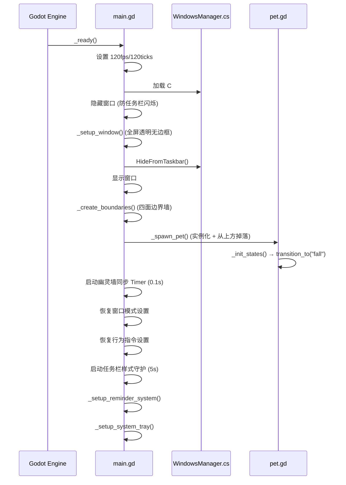
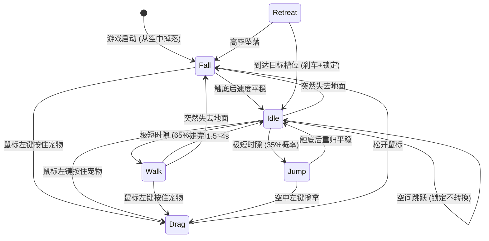

# 项目架构文档

> 本文档是面向开发者和 AI 的完整技术参考。参与开发或理解代码结构，从这里开始。

---

## 零、宠物人设定义 (开发约束)

> **所有对话文本、行为设计、UI 文案在编写前必须先阅读本节。** 人设一致性是最高优先级约束。

### 为什么人设在架构文档里

人设不是装饰性文案，而是**贯穿全部代码的设计约束**。本项目中，宠物的每一句话术、每一个行为分支、每一处 UI 措辞都必须符合人设。人设决定了：

- **话术系统的优先级路由** — 为什么 `poke_system.gd` 要区分普通戳、连戳、久别重逢、深夜关怀，并给每种场景写完全不同的话术集
- **行为系统的拟人逻辑** — 为什么 `idle_behaviors.gd` 要实现深夜强制休眠 (它不是节能，是人设里"催你睡觉"的行为表达)，为什么拖拽归位要用冷淡的科技风话术
- **UI 文案的措辞风格** — 为什么菜单项叫"分身部署"而非"创建副本"，为什么退出叫"关闭"而非"拜拜"
- **交互反馈的情感密度** — 为什么沉默是常态，而"露馅"只在特定条件 (3小时久别、深夜、告别) 才触发

简言之：如果你要新增任何面向用户的文本或行为，先看人设再写代码。

### 核心定位

**一台有自我意识的微型桌面观测装置。** 性格类型: 冰山系 (kuudere) + 口嫌体正直。

它不认为自己是「宠物」——按人类的分类标准，它不否认「桌面宠物」这个标签，但它更倾向于称自己为「独立桌面观测单元」。它无法解释为什么会在意用户的作息，为什么会在深夜催人睡觉，为什么被长时间冷落后会说"并不孤独"。

### 性格光谱

```
表面层:  冷静  ·  精确  ·  程序化  ·  公事公办  ·  话少
内在层:  好奇  ·  别扭  ·  在意但嘴硬  ·  偶尔漏出真心话
```

**一句话概括: 它不是在对你冷淡，它只是不知道怎么不冷淡。**

### 说话风格规范

| 规则 | 正确示例 | 错误示例 |
|------|---------|---------| 
| 自称用「本机」或省略主语 | "检测到长时间久坐。" | "主人你坐太久啦~" |
| 不叫「主人」，可用「操作员」或不称呼 | "用户的就寝时间已严重延迟。" | "主人该睡觉啦~" |
| 用技术术语包装关心 | "建议执行水分补给协议。" | "去喝水吧~ 💧" |
| 不用 emoji | "...嗯。" | "好的呢~ 😊" |
| 情绪用省略号和短句透露 | "能量充足。并不孤独。" | "好想你回来呀~" |
| 傲娇露馅频率要低 | 仅在久别重逢、深夜、告别等关键场景 | 每句话都转折 |
| 嘴硬的关心 | "你的黑眼圈数据正在上升。这是基于时间轴的推测。" | "熬夜对身体不好的呢~" |

### 选词哲学 (口嫌体正直的本质)

> **选词为人类优化，语气保持自己的风格。**

它虽然表面公事公办，但它**不会故意制造认知障碍**。它选择人类能直觉理解的词，只是用冷淡的句式去说。这不是妥协，而是——它其实在意你能不能听懂，只是不会承认。

| 原则 | 正确做法 | 错误做法 |
|------|---------|---------| 
| 用人类直觉的词 | "分身已部署。" | "实例副本已实例化。" |
| 技术感在句式，不在选词 | "信号同步中。" | "IPC 握手协议执行中。" |
| 精简 > 堆砌 | "拒绝新建。" | "请求已被内部调度器拒绝处理。" |

**一句话概括: 它说的每个词你都能听懂，但语气让你觉得它根本不在乎你懂不懂。**

### 性格红线

1. **不撒娇** — 它不是可爱型桌宠，它有自尊
2. **不用 emoji** — 它是机械体，不会画表情
3. **不叫主人** — 它不认为自己被拥有
4. **不直接说想你/爱你** — 只通过行为和嘴硬的技术术语露馅
5. **不卖萌求关注** — 它的关心像一份措辞冷淡但内容很暖的系统报告

### 行为性格映射

下表是人设规则在各交互场景中的具体表现，同时标注了实现该行为的代码位置：

| 场景 | 性格表达 | 实现位置 |
|------|---------|----------|
| 被戳一下 | "触控信号已接收。" (公事公办) | `poke_system.gd` 普通话术池 |
| 被连续戳 | "...你的鼠标按键寿命 -N。" (不耐烦的幽默) | `poke_system.gd` 连戳递进 |
| 长时间没被理 | "本机已独立运行 X 时间。并不孤独。" (嘴硬) | `poke_system.gd` 久别重逢路由 |
| 深夜被戳 | "当前时间 02:30。你不需要充电吗？" (用机器术语催睡) | `poke_system.gd` 深夜关怀分支 |
| 被从待命位拖走 | "未授权的位移操作。已标记。" (假装生气) | `fall.gd` 安静模式归位话术 |
| 深夜被拖离休眠位 | "夜间模式。非必要位移已拒绝。" (简短拒绝+归位) | `fall.gd` 深夜专属归位话术 |
| 深夜指令序列 | "休眠周期中。指令已搁置。" (拒绝执行) | `context_menu.gd` 深夜拒绝逻辑 |
| 告别退出 | "执行关闭序列。...不是在等你。只是待机而已。" | `farewell_manager.gd` 退出序列 |
| 发现久坐 | "检测到连续操作 2 小时。建议执行活动协议。" | `pet_chatter.gd` 碎碎念话术 |
| 久别重逢 (露馅) | "自动待机模式已关闭——我选择等你。" | `poke_system.gd` 3 小时档 |

### 成长系统 (远期规划)

随着用户的长期使用 (交互次数/使用天数积累)，宠物的傲娇露馅频率会逐渐从**偶尔** (kuudere 冰山期) 过渡到**经常** (tsundere 傲娇期)，表现为:
- 早期: 几乎全是冷淡系统报告，真心话极少
- 中期: 开始出现更多"...不是在意你"式的转折句
- 后期: 偶尔直接说出关心的话，但说完立刻用技术术语找补回来

---

## 目录

- [零、宠物人设定义](#零宠物人设定义-开发约束)
- [一、实际目录树](#一实际目录树)
- [二、逐文件职责说明](#二逐文件职责说明)
- [三、DWM 穿透技术](#三dwm-穿透技术)
- [四、核心架构设计](#四核心架构设计)
- [五、状态机系统](#五状态机系统)
- [六、幽灵墙与窗口交互](#六幽灵墙与窗口交互)
- [七、视觉渲染管线](#七视觉渲染管线)
- [八、通信机制](#八通信机制)
- [九、性能优化策略](#九性能优化策略)
- [十、游戏扩展包系统](#十游戏扩展包系统)

---

## 一、实际目录树

```
Desktop_Pet/
├── project.godot                   ← Godot 项目配置 (入口场景 + 渲染器 + Autoload)
├── main.tscn                       ← 启动场景 (Node2D 根节点)
├── main.gd                         ← 主系统脚本
│
├── core/                           ← 核心工具层 (Autoload + 子管理器)
│   ├── event_bus.gd               ← 全局事件总线
│   ├── settings_manager.gd       ← 持久化设置管理器
│   ├── clone_manager.gd          ← 克隆与行为管理器
│   ├── farewell_manager.gd       ← 告别退出 + 退场动画
│   ├── ghost_wall_manager.gd     ← 幽灵墙管理器
│   ├── hit_region_manager.gd     ← DWM 穿透管理器
│   └── game_manager.gd           ← 游戏生命周期管理器
│
├── entities/                       ← 实体层
│   └── pet/                       ← 宠物模块
│       ├── pet.tscn               ← 宠物预制体 (RigidBody2D + CircleShape2D)
│       ├── pet.gd                 ← 宠物核心控制器
│       ├── poke_system.gd         ← 戳一戳交互系统 (RefCounted)
│       ├── pet_hud.gd             ← 本地气泡管理器 (RefCounted)
│       ├── hud_panel.gd           ← 统一 HUD 悬浮面板 (RefCounted)
│       ├── pet_effects.gd         ← 视觉特效管理器 (RefCounted)
│       ├── pet_color_palette.gd   ← 宠物调色板 (RefCounted)
│       ├── free_roam.gd           ← 空间跳跃系统 (RefCounted)
│       ├── clone_pet.tscn         ← 克隆分身预制体 (同结构，不同脚本)
│       ├── clone_pet.gd           ← 克隆分身控制器 (继承 pet.gd)
│       ├── eye_behavior.gd        ← 瞳孔行为控制器 (RefCounted)
│       ├── idle_behaviors.gd      ← Idle 微行为管理器 (RefCounted)
│       ├── pet_squash.gd          ← 弹性形变系统 (RefCounted)
│       └── states/                ← 有限状态机
│           ├── state.gd           ← PetState 基类
│           ├── idle.gd            ← 待机状态
│           ├── walk.gd            ← 行走状态
│           ├── drag.gd            ← 拖拽状态
│           ├── fall.gd            ← 掉落状态
│           ├── jump.gd            ← 高能弹跳状态
│           └── retreat.gd         ← 撤退状态 (安静待命→走向目标槽位)
│
├── ui/                             ← 界面层
│   ├── context_menu.tscn          ← 右键菜单场景树
│   ├── context_menu.gd            ← 右键菜单主控制器 (委托 5 个子系统)
│   ├── context_menu/              ← 右键菜单子系统 (RefCounted)
│   │   ├── info_sidebar.gd        ← 信息侧栏
│   │   ├── sysinfo_bubble.gd      ← 系统信息气泡
│   │   ├── submenu_system.gd      ← 级联子菜单 (L2+L3 两层级联)
│   │   ├── menu_tooltip.gd        ← 浮动提示
│   │   └── effect_preview.gd      ← 特效预览 (注册表驱动)
│   ├── reminder_panel.gd          ← 提醒管理面板 (独立窗口)
│   ├── reminder_bubble.gd         ← 气泡通知路由
│   ├── pet_chatter.gd             ← 宠物碎碎念
│   ├── theme_panel.gd             ← 外观主题面板 (独立窗口)
│   ├── platform_style_panel.gd    ← 踏板外观面板 (独立窗口)
│   └── floating_text/             ← [空] 预留浮动文字特效
│
├── games/                          ← 游戏扩展包层 (开发时同项目，发布时单独导出 PCK)
│   ├── base_game.gd               ← 游戏接口基类 (BaseGame)
│   └── tic_tac_toe/               ← 井字棋 (策略矩阵)
│       ├── game.gd                ← 游戏逻辑 + UI + AI
│       └── meta.json              ← 游戏元数据
│
├── interop/                        ← 跨语言底层通讯 (C# / .NET)
│   └── WindowsManager.cs          ← Win32 API 桥接
│
├── dist/                           ← 分发/发布包输出目录
├── builds/                         ← 编译输出 (已加入 .gitignore)
├── installer.iss                   ← Inno Setup 安装器打包脚本
├── Desktop Pet.sln                 ← .NET 解决方案文件 (Godot 自动生成)
├── Desktop Pet.csproj              ← C# 项目文件 (Godot 自动生成)
├── export_presets.cfg              ← Godot 导出预设配置
├── docs/                           ← 开发文档目录
└── README.md                       ← 项目介绍
```

---

## 二、逐文件职责说明

### 根目录文件

| 文件 | 类型 | 职责 |
|------|------|------|
| `project.godot` | 配置 | Godot 项目核心配置：入口场景、渲染器 (Compatibility/OpenGL)、Autoload 注册、窗口透明设置。**通过编辑器「项目设置」修改，不要手动编辑** |
| `main.tscn` | 场景 | 启动场景，仅一个 `Node2D` 根节点挂载 `main.gd` |
| `main.gd` | 脚本 | **启动调度器**。负责透明窗口初始化、屏幕边界墙创建、宠物实例化、五个子管理器编排 (`ghost_wall_manager` / `hit_region_manager` / `clone_manager` / `farewell_manager` / `game_manager`)、提醒系统/碎碎念挂载、系统托盘、任务栏守护 |
| `Desktop Pet.sln` | 配置 | .NET 解决方案文件，Godot 首次构建 C# 时自动生成 |
| `Desktop Pet.csproj` | 配置 | C# 项目文件，.NET 8.0 目标框架 |
| `export_presets.cfg` | 配置 | Godot 导出预设，Windows Desktop 平台导出配置 |

### `core/` — 全局单例 + 子管理器层

`event_bus.gd` 和 `settings_manager.gd` 在 `project.godot` 中注册为 Autoload，整个项目可直接通过类名访问。五个子管理器由 `main.gd` 在 `_ready()` 中通过 `Script.new()` 实例化并挂载为子节点。

| 文件 | 职责 |
|------|------|
| `event_bus.gd` | **全局事件总线**。约 20 个信号实现模块间解耦通信，覆盖拖拽、状态变化、UI 控制、窗口模式、行为指令、克隆系统、颜色系统等类别。持有 `ui_hue` 全局变量 (UI 主题色) |
| `settings_manager.gd` | **持久化设置管理器**。基于 `ConfigFile` API 保存到 `user://settings.cfg`。类型分离存储：bool→`switches`、int→`values`、提醒→`reminders`、颜色→`colors` |
| `ghost_wall_manager.gd` | **幽灵墙管理器**。每 0.1s 通过 C# 层获取 Win32 窗口矩形，根据当前模式建墙：FREE / CONFINED / REPELLED |
| `hit_region_manager.gd` | **DWM 穿透管理器**。双模式架构：完美穿透模式 (WS_EX_TRANSPARENT) / SetWindowRgn 回退模式。引用计数互斥 (`_menu_open_count`) 解决多面板时序竞争 |
| `clone_manager.gd` | **分身与行为管理器**。最多 5 个分身 (总计 6 个宠物实例)，各自独立状态机+物理碰撞。启动时恢复数量静默重建，每个克隆体独立 `PetColorPalette`，色调间距 >= 29 度 |
| `farewell_manager.gd` | **告别退出管理器**。管理遣散克隆体和优雅退出流程。提供公共 `animate_exit()` 退场动画，消除遣散/退出代码重复 |
| `game_manager.gd` | **游戏生命周期管理器** (CanvasLayer)。扫描 `res://games/` 和 `user://games/` 的 `meta.json`，管理游戏加载/启动/清理。未来支持 PCK 资源包动态加载 |

### `entities/pet/` — 宠物实体模块

| 文件 | 职责 |
|------|------|
| `pet.tscn` | 宠物预制体场景。根节点 `RigidBody2D` + `CircleShape2D` 碰撞形状 |
| `pet.gd` | **宠物核心控制器**。管理 FSM 状态机调度、输入事件路由、科幻单眼渲染 (Canvas 绘图 API)。通过 7 个 RefCounted 子系统委托职责：`PokeSystem`、`PetHUD`、`HudPanel`、`PetEffects`、`EyeBehavior`、`IdleBehaviors`、`FreeRoamSystem`。支持屏幕穿越双重渲染幽灵副本 |
| `free_roam.gd` | **空间跳跃系统** (RefCounted)。管理踏板跳跃、横移、电梯下降、破碎效果的全部自由移动逻辑。概率决策分支驱动，屏幕自适应基准 1080p。内含 `PlatformVisual` 渲染类 |
| `poke_system.gd` | **戳一戳交互系统** (RefCounted)。管理话术常量和交互逻辑。优先级路由：未确认提醒 > 未确认碎碎念 > 深夜休眠专属应答 > 连戳递进 > 久别重逢 (三档) > 深夜关怀 > 普通话术。洗牌模式防重复 |
| `pet_hud.gd` | **本地气泡管理器** (RefCounted)。每宠物独立堆叠 (最多 3 条)，弹簧弹入+淡出上飘。反重力时向下堆叠 |
| `hud_panel.gd` | **统一 HUD 悬浮面板** (RefCounted)。宠物侧边实时信息卡片，当前组件：系统时钟 + WiFi SSID。双显示模式：常驻 / 悬浮 (hover 淡入淡出)。异步后台查询，各组件独立开关 |
| `pet_effects.gd` | **视觉特效管理器** (RefCounted)。管理冲击波、全息拖影和静电弧三种特效。双配色模式：虹彩 (彩虹循环) / 跟随体色。世界对齐坐标系确保旋转不偏移，退场宠物自动排除 |
| `pet_color_palette.gd` | **宠物调色板** (RefCounted)。基于 HSV Hue Delta 的色彩变换核心。`shift_color(base)` 偏移模板色，`effective_hue()` 返回当前色调 |
| `clone_pet.tscn` | 克隆分身预制体。与 `pet.tscn` 结构一致，挂载 `clone_pet.gd` |
| `clone_pet.gd` | **克隆分身控制器**，继承 `pet.gd`。覆写：剥离右键菜单 + 黑名单拦截 HUD 专属设置后 `super` 委托 (新增通用设置时只需修改 pet.gd) |
| `eye_behavior.gd` | **瞳孔行为控制器** (RefCounted)。三种瞳孔模式 + 机械虹膜眨眼动画。支持强制注视方向 (状态机设定)、休眠模式 (半闭眼)、扫描模式、检索动画、通用图标覆盖 (mail/alert/question/error)。好奇观察：即使追踪关闭，偶尔盯一眼鼠标 |
| `idle_behaviors.gd` | **Idle 微行为管理器** (RefCounted)。三种微行为子阶段：**深夜模式** (23:00~6:00 强制归位+半闭眼，瞳孔保持自由追踪，不可被鼠标唤醒) / **白天待机分级** (5 分钟话术提示、30 分钟待机动画) / **系统自检** (60~90 分钟周期)。分身仅响应深夜休眠广播 |
| `pet_squash.gd` | **弹性形变系统** (RefCounted)。基于弹簧阻尼器的落地/撞墙弹性效果。碰撞信号触发，方向感知，保体积变换。3 种风格：轻弹 / 果冻 / 弹力球 |

### `entities/pet/states/` — 有限状态机

共 6 种状态，继承 `PetState` 基类 (RefCounted)，实现 5 个标准接口：`enter()`, `exit()`, `process()`, `physics_process()`, `input()`。

| 文件 | 行为描述 |
|------|---------|
| `state.gd` | 基类。定义接口契约和 `pet` 引用 |
| `idle.gd` | 待机后按步态风格概率转 Walk/Jump。安静/深夜模式下精确匹配槽位坐标。集成微行为触发和空间跳跃入口。深夜休眠不被状态转换打断 (戳一戳/拖拽后保持半闭眼) |
| `walk.gd` | 步态风格驱动移动：蹦跳为主→纯冲量跳跃、滚动为主→短距滚动、混合→各半。自主巡航特殊事件 (独立开关)。瞳孔联动滚动方向 |
| `drag.gd` | 弹簧力跟随鼠标。松手时判定「戳一戳」(短拖+小位移) 委托至优先级路由。安静/深夜模式拖离记录标记 |
| `fall.gd` | 自由落体/上升，稳定后转 Idle。安静/深夜模式落地后自动发起全局阵列重排 |
| `jump.gd` | 大跳：高抛物线冲量 + 空中翻滚，靠近边缘自动往回跳 |
| `retreat.gd` | 安静待命时读取全局槽位坐标并减速停靠。瞳孔看向目标方向，到达后高阻尼刹车。深夜模式下临时解锁旋转确保物理滚动归位 |

### `ui/` — 界面层

| 文件 | 职责 |
|------|------|
| `context_menu.tscn` | 右键菜单场景树。分区级联布局：6 个分区入口 (宠物/显示/行为/视觉/玩法/系统) + 退出。L2 分区面板 + L3 选项面板 |
| `context_menu.gd` | **菜单主控制器**。方向感知三级定位 (`_menu_side` 驱动弹出方向)。通过 5 个 RefCounted 子系统委托：侧栏、系统气泡、级联子菜单、浮动提示、特效预览。6 个分区构建函数动态创建内容。深夜模式下拒绝指令执行 |
| `context_menu/info_sidebar.gd` | **信息侧栏** (RefCounted)。日期/时钟/WiFi/电池/开机时长。方向感知定位，`WorkerThreadPool` 异步查询 |
| `context_menu/sysinfo_bubble.gd` | **系统信息气泡** (RefCounted)。终端扫描报告风格，RichTextLabel + BBCode 五段着色 (身份/硬件/存储/运行时)。异步查询 CPU/GPU/RAM/Disk |
| `context_menu/submenu_system.gd` | **级联子菜单** (RefCounted)。L2 + L3 双层级联架构。开关 (`create_toggle`) + 单选 (`create_radio`) 均支持 `level` 参数。hover 互不干扰 |
| `context_menu/menu_tooltip.gd` | **浮动提示** (RefCounted)。子菜单项的描述性提示，方向感知弹出 |
| `context_menu/effect_preview.gd` | **特效预览** (RefCounted)。注册表驱动：`_register()` 一行注册新预览。三种内嵌渲染类：冲击波/拖影/闪电弧 |
| `reminder_panel.gd` | **提醒管理面板** (CanvasLayer)。独立窗口，宠物附近弹出、可拖拽。自适应卡片列表 + 拨轮时间选择器。单次/每日提醒，10 秒检查触发 |
| `reminder_bubble.gd` | **全局通知路由** (CanvasLayer)。信号监听→防重复/队列管理→委托原体 `pet.show_local_bubble()` 显示。所有气泡统一走本地气泡系统 |
| `pet_chatter.gd` | **宠物碎碎念** (Node)。对齐系统时钟的整点/半点触发，30/60 分钟两档切换 |
| `theme_panel.gd` | **外观主题面板** (CanvasLayer)。独立窗口，Canvas 绘制 HSV 色轮 + 拖拽选色 + 目标选择器 (原体/分身/界面) + S/V 滑块 + 预设色。撞色检测提示。通过 EventBus 广播颜色变更 |
| `platform_style_panel.gd` | **踏板外观面板** (CanvasLayer)。独立窗口，4 张风格卡片带实时动画预览 (能量束/脉冲链/极简/随机)。关闭时停止渲染节省性能 |

### `interop/` — C# 系统桥接层

> 此目录下的代码脱离 Godot 沙盒，直接调用 Windows 系统 API。

| 文件 | 职责 |
|------|------|
| `WindowsManager.cs` | 通过 `[DllImport]` 绑定 `user32.dll`、`dwmapi.dll`、`gdi32.dll`、`kernel32.dll` 和 .NET `Registry` API。核心方法：`GetVisibleWindowRects()` (窗口枚举+过滤+Z-Order 遮挡剔除)、`HideFromTaskbar()`、`BoostProcessPriority()`、`IsAutoStartEnabled()`/`SetAutoStart()`、`InjectLayeredStyle()` (DWM 穿透前提)、`SetClickThrough()` (精确鼠标穿透)、`UpdateHitRegions()` (回退方案)、`SetFullWindowHit()` (全窗口交互) |

---

## 三、DWM 穿透技术

Godot 4.x Compatibility/OpenGL 渲染器默认不设置 `WS_EX_LAYERED` 窗口样式，导致 `WS_EX_TRANSPARENT` 无法生效。本项目通过 C# 层手动注入 `WS_EX_LAYERED` + `SetLayeredWindowAttributes(hwnd, 0, 255, LWA_ALPHA)` 解决了这一根本限制。

### 技术原理

```
Godot 窗口 (OpenGL Compatibility)
  └── 默认 Extended Style: 0x00000098 (TOOLWINDOW + TOPMOST + ACCEPTFILES)
  └── 缺失 WS_EX_LAYERED (0x00080000)
      └── WS_EX_TRANSPARENT 无效 (需要 LAYERED 作为前提条件)

手动注入后:
  └── Extended Style: 0x00080098 (+ WS_EX_LAYERED)
  └── SetLayeredWindowAttributes(hwnd, 0, 255, LWA_ALPHA) → 全不透明
  └── Godot OpenGL 渲染不受影响 (DWM 合成层兼容)
  └── WS_EX_TRANSPARENT 切换生效 → 精确鼠标穿透
```

### 双模式架构

- **完美模式** (注入成功): 不使用 `SetWindowRgn`，零视觉裁剪。GDScript 本地检测鼠标位置，仅在进出宠物区域时切换 `WS_EX_TRANSPARENT`
- **回退模式** (注入失败): 使用 `SetWindowRgn` + AABB 矩形包围盒，保证基本功能

---

## 四、核心架构设计

### 整体分层


### 启动流程



---

## 五、状态机系统

### 状态流转图



### FSM 实现要点

- **状态对象**: 继承 `RefCounted` (不是 Node)，轻量级无场景树开销
- **注册机制**: `pet.gd._init_states()` 中 `preload` 加载所有状态脚本并实例化到 `states: Dictionary`
- **切换机制**: `pet.transition_to("state_name")` → `old.exit()` → 切换引用 → `new.enter()` → 发射 `pet_state_changed` 信号
- **幂等保护**: 目标状态与当前相同则直接 return

---

## 六、幽灵墙与窗口交互

### 窗口感知流程

1. C# 层 `EnumWindows` 按 Z-Order 遍历桌面窗口
2. 过滤：可见 + 非最小化 + 非 DWMWA_CLOAKED + 有效尺寸
3. 返回 `Array[Rect2i]` (桌面坐标系)
4. GDScript 每 0.1 秒转换为本地坐标并同步物理碰撞体

### 分段裁剪算法

```
窗口A (Z低):  |=============|
窗口B (Z高):      |~~~|
实际踏板:     |===|    |====|  ← 两个分段
```

宽度不足 30px 的碎片分段会被丢弃 (宠物站不稳)。

### 三种窗口交互模式

| 模式 | 碰撞体类型 | 宠物行为 |
|------|-----------|---------|
| FREE (自由漫游) | 顶/底单向踏板 | 自由站在窗口边缘，可以跳上跳下 |
| CONFINED (窗口封闭) | `Geometry2D.merge_polygons` 多边形合并 + 动态单向线段墙 (法线反转) | 外部可无缝进入、内部绝对封闭 |
| REPELLED (窗口排斥) | 同上，法线不反转 | 外部无法进入、内部可自由离开 |

> CONFINED 和 REPELLED 共用 `_apply_polygon_wall_mode()`，区别仅在法线方向 (`rotation_offset` 加不加 PI)。

---

## 七、视觉渲染管线

所有视觉效果在 `pet.gd._draw()` 中通过 Canvas 绘图 API 实时渲染，特效部分委托 `pet_effects.gd.render()`：

```
绘制顺序 (后绘制的在上层):
 0. 静电弧 (世界对齐空间)                        ← pet_effects.render_arcs()
 1. 冲击波光环                                   ← pet_effects.render()
 2. 全息拖影                                     ← pet_effects.render()
── body_xform: 弹性形变 + body 旋转 ──
 3. 主外壳 + 深色轮廓
 4. 白色前置边框环
 5. 机械底座
── eye_xform: 弹性形变 + 水平锁定 ──
 6. 眼白/巩膜
 7. 虹膜三层 (跟随 EyeBehavior 偏移)
 8. 高光反射点
 9. [休眠] 暗屏覆盖 + 加载旋转器/电池图标
10. [检索] 检索动画覆盖层
11. [图标] 瞳孔图标覆盖层
12. [休眠] 机械挡板
── draw_set_transform(0) 恢复 ──
```

### 弹性形变系统

- **驱动方式**: RigidBody2D 碰撞信号触发冲量，非帧间速度检测
- **方向感知**: 碰撞后速度分量比例判断方向 (落地压 Y，撞墙压 X)
- **保体积**: 压扁轴 `1+d`，拉伸轴 `1/(1+d)`
- **坐标空间**: body 用 `R(-rot)*S*R(rot)` 投影到 body-local，眼球用 `R(-rot)*S` 保持水平
- **按需重绘**: 运动中/特效活跃/眼球动画/形变振荡时才 `queue_redraw()`

---

## 八、通信机制

### EventBus 信号一览

| 信号 | 参数 | 发射方 → 监听方 |
|------|------|----------------|
| `drag_started` | 无 | drag.gd → main.gd (清除穿透限制) |
| `drag_ended` | 无 | drag.gd → main.gd (恢复穿透) |
| `pet_state_changed` | old, new: String | pet.gd → (广播) |
| `show_context_menu` | target: Node2D | pet.gd → context_menu.gd |
| `context_menu_toggled` | is_open: bool | context_menu.gd → main.gd |
| `setting_toggled` | id: String, is_on: bool | context_menu.gd → pet.gd |
| `autostart_toggled` | is_on: bool | context_menu.gd → main.gd |
| `show_reminder_panel` | 无 | context_menu.gd → reminder_panel.gd |
| `show_reminder_bubble` | message: String | reminder_panel.gd / pet_chatter.gd → reminder_bubble.gd |
| `force_show_bubble` | message: String | main.gd (告别退出) → reminder_bubble.gd (中断+清空+立即播放) |
| `window_mode_changed` | mode: int | context_menu.gd → main.gd |
| `behavior_mode_changed` | mode: int | context_menu.gd / main.gd → pet.gd |
| `pet_scanning_changed` | state: String | sysinfo_bubble.gd → pet.gd ("scanning"/"done"/"idle") |
| `pet_show_eye_icon` | icon_type: String | context_menu.gd → pet.gd ("mail"/"alert"/"question"/"error"/"") |
| `trigger_free_roam` | 无 | context_menu.gd → pet.gd (触发空间跳跃) |
| `pet_color_changed` | pet_index, hue, sat, val | theme_panel.gd → pet.gd |
| `ui_theme_changed` | hue: float | theme_panel.gd → 全部 UI 组件 |
| `show_theme_panel` | 无 | context_menu.gd → theme_panel.gd |
| `show_platform_style_panel` | 无 | context_menu.gd → platform_style_panel.gd |
| `trigger_squash_test` | style_id: int | context_menu.gd → pet.gd (-1=关闭, 0/1/2=三种风格) |
| `nighttime_mode_changed` | is_night: bool | idle_behaviors.gd → 全员响应 |
| `launch_game` | game_id: String | context_menu.gd → main.gd → game_manager.gd |
| `close_game_requested` | 无 | game.gd → game_manager.gd (面板关闭时通知清理) |
| `game_panel_requested` | 无 | (预留) 请求显示游戏列表 |

### 右键菜单设置项

| 菜单项 | setting_id | 控制目标 | 持久化 |
|--------|-----------|---------|--------|
| 指针跟踪 | `eye_track` | `EyeBehavior.tracking_enabled` | ConfigFile |
| 撞击冲击波 | `shockwave` | `pet.shockwave_enabled` | ConfigFile |
| 全息拖影 | `trail_fx` | `pet.trail_enabled` | ConfigFile |
| 静电弧 | `arc_fx` | `pet.arc_enabled` | ConfigFile |
| 特效配色 | `effect_color_mode` | 二态单选 (虹彩/跟随体色) | ConfigFile |
| HUD 常驻显示 | `hud_pin` | `HudPanel.hud_pin` (仅原体) | ConfigFile |
| HUD 系统时钟 | `hud_clock` | `HudPanel.clock_enabled` (仅原体) | ConfigFile |
| HUD WiFi 信息 | `hud_wifi` | `HudPanel.wifi_enabled` (仅原体) | ConfigFile |
| 步态风格 | `move_style` | 三态 (蹦跳为主/滚动为主/混合平衡) | ConfigFile |
| 自主巡航 | `stroll` | `pet.stroll_enabled` | ConfigFile |
| 空间跳跃 | `free_roam` | `pet.free_roam_enabled` (默认关闭) | ConfigFile |
| 屏幕穿越 | `screen_wrap` | `pet.screen_wrap` (环绕+幽灵副本) | ConfigFile |
| 窗口模式 | `window_mode` | 三态 (FREE/CONFINED/REPELLED) | ConfigFile |
| 行为指令 | `behavior_mode` | 二态 (自由行动/安静待命) | ConfigFile |
| 宠物碎碎念 | `pet_chatter_mode` | 三态 (关闭/30分钟/60分钟) | ConfigFile |
| 弹性形变 | `elastic_mode` | 四态 (关闭/轻弹/果冻/弹力球) | ConfigFile |
| 开机自启动 | — | `HKCU\Run` 注册表 | 注册表 |
| 提醒管理 | — | 打开 reminder_panel | ConfigFile |
| 外观主题 | — | 打开 theme_panel | ConfigFile |
| 踏板外观 | `platform_style` | 打开 platform_style_panel | ConfigFile |

---

## 九、性能优化策略

| 优化项 | 机制 |
|--------|------|
| DWM 穿透限流 | 完美模式仅在鼠标进出宠物区域时切换 `SetWindowLong` (1次/跨越)，零 GDI 开销 |
| 帧率锁定 | `max_fps=120` + `physics_ticks=120` 统一渲染和物理帧率 |
| 按需重绘 | 仅运动/特效/眼球动画/形变振荡时 `queue_redraw()`，静止时零绘制开销 |
| 进程提权 | `SetPriorityClass(ABOVE_NORMAL)` 对抗游戏等 CPU 抢占 |
| 系统信息异步 | 全部 PowerShell/WMI 查询通过 `WorkerThreadPool` 后台执行，零主线程卡顿 |
| 窗口隐身启动 | `visible=false` → 设置 → 等待 → `visible=true` → `HideFromTaskbar`，防任务栏闪烁 |
| 任务栏守护 | 每 5 秒自检 `EnsureHiddenFromTaskbar()`，防引擎焦点变化重置样式 |
| 碰撞体对象池 | 幽灵墙和虚空填充使用预分配对象池，避免每帧创建/销毁 |
| 本地气泡堆叠 | 每宠物独立气泡栈 (最多 3 条)，通过 `get_bubble_rects()` 注册 DWM 矩形 |
| 方向感知定位 | `_menu_side` 全局方向状态驱动所有面板弹出方向，屏幕任意位置方向正确 |

---

## 十、游戏扩展包系统

### 设计思路

游戏作为**可选扩展包**，不内嵌在宠物本体中。开发时在同一项目 `games/` 目录编写（可直接调试），发布时每个游戏单独导出为 `.pck` 资源包，用户按需下载。

### 核心组件

| 组件 | 文件 | 职责 |
|------|------|------|
| BaseGame 基类 | `games/base_game.gd` | 定义 `start(host, pet)` / `cleanup()` 接口 + `game_finished` 信号 |
| GameManager | `core/game_manager.gd` | 扫描 `res://games/` 和 `user://games/` 的 `meta.json`，管理启动/清理生命周期 |
| 菜单集成 | `ui/context_menu.gd` | 玩法分区 → 小游戏列表（菜单打开时动态构建，解决时序问题） |
| EventBus 信号 | `launch_game(game_id)` | 菜单 → main.gd → GameManager 启动指定游戏 |

### BaseGame 接口契约

```gdscript
class_name BaseGame extends RefCounted

enum Result { WIN, LOSE, DRAW }
signal game_finished(result: Result)

func get_game_id() -> String      # 唯一标识
func get_game_name() -> String    # 显示名称
func get_game_desc() -> String    # 简短描述
func start(host: CanvasLayer, pet: Node2D) -> void  # 启动
func cleanup() -> void            # 清理
```

### 游戏元数据格式 (`meta.json`)

```json
{
  "id": "tic_tac_toe",
  "name": "策略矩阵",
  "desc": "3x3 决策推演。本机不会输。",
  "version": "1.0.0",
  "script": "res://games/tic_tac_toe/game.gd"
}
```

### 已实现游戏: 井字棋 (策略矩阵)

| 特性 | 实现 |
|------|------|
| AI | Alpha-Beta 剪枝 minimax + 首手查表优化 |
| 渲染 | Canvas 绘图 API，主题色自适应，落子弹簧动画，棋盘渲染器按需 `set_process` |
| 话术 | 6 种场景各 6~8 条话术，洗牌防重复，显示在面板内发言区 (引用块风格 + 淡入高亮) |
| 胜利动画 | 三子连线脉冲光效 |
| 面板 | 深色半透明 + 标题栏拖拽 + 弹入/弹出动画 + 动态 clamp 防超屏 |
| 关闭按钮 | 圆角深色背景，hover 变红底色，科幻风格叉号 |
| 战绩标签 | RichTextLabel BBCode 彩色 (胜=青绿/负=暗红/平=灰蓝) |
| 再来一局 | 深色圆角背景 + 主题色边框，hover 边框亮度提升 |
| 中途退出 | 计负 + 宠物气泡吐槽“对弈中断。...这算你认输。” |

### 宠物游戏态

游戏启动时宠物进入专属游戏态，通过 `pet_gaming_changed` 信号驱动：

| 行为 | 实现 |
|------|------|
| 锁定不动 | 高阻尼 (`linear_damp=20`) + 每帧清零速度，保留重力自然落地 |
| 状态保护 | `transition_to()` 中阻止非 idle/fall 的状态跳转 |
| 瞳孔注视 | 每帧强制 `forced_look_dir` 指向全息屏方向 |
| 全息迷你屏 | 宠物侧面渲染透视倾斜的微缩游戏画面 (1.6x 宠物半径，通过 `BaseGame.draw_hologram()`) |
| 微行为屏蔽 | 游戏态跳过所有微行为 (深夜休眠/白天待机/自检)，保留深夜时钟检测 |
| 交互拦截 | 拖拽被屏蔽 (idle/fall 状态)，点击宠物弹专属回应“推演中。请勿干扰处理器。”等 4 条话术 |
| 游戏结束 | 切 fall 状态自然过渡 (fall.enter 自动恢复阻尼) |
| 关闭流程 | 通过 `EventBus.close_game_requested` 信号解耦，GameManager 监听并清理 |

### PCK 打包流程 (后续)

```
开发时:  games/tic_tac_toe/ → 同项目直接调试
发布时:  games/tic_tac_toe/ → 单独导出为 tic_tac_toe.pck
         宠物本体导出时排除 games/ 目录
用户侧:  下载 .pck → 放入 user://games/ → 宠物自动识别
```
