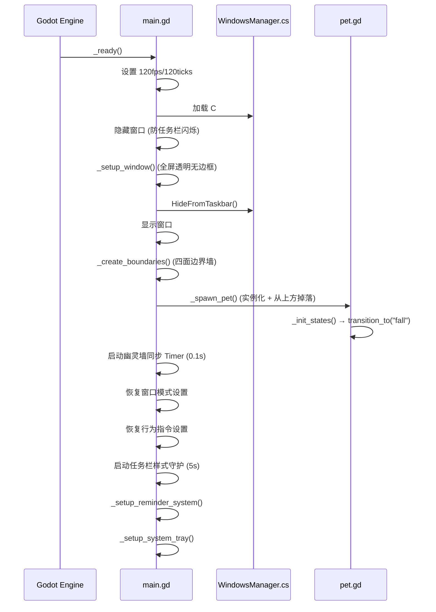
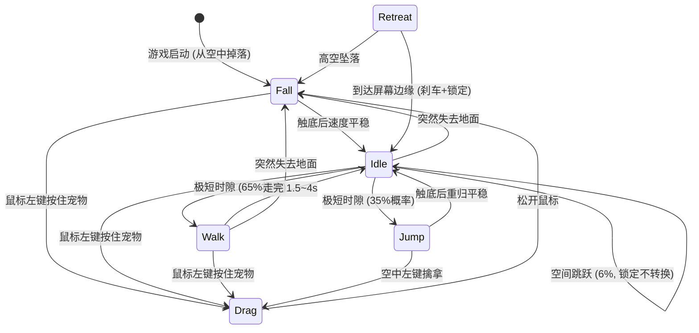

# 📐 项目架构文档

> 本文档是面向开发者的完整技术参考。如果你要参与开发或理解代码结构，从这里开始。

---

## 零、宠物人设定义 (开发约束)

> ⚠️ **所有对话文本、行为设计、UI 文案在编写前必须先阅读本节。** 人设一致性是最高优先级约束。

### 核心定位

**一台有自我意识的微型桌面观测装置。** 性格类型: 冰山系 (kuudere) + 口嫌体正直。

它不认为自己是「宠物」——按人类的分类标准，它不否认「桌面宠物」这个标签，但它更倾向于称自己为「独立桌面观测单元」。它无法解释为什么会在意用户的作息，为什么会在深夜催人睡觉，为什么被长时间冷落后会说"并不孤独"。

### 性格光谱

```
表面层:  冷静  ·  精确  ·  程序化  ·  公事公办  ·  话少
内在层:  好奇  ·  别扭  ·  在意但嘴硬  ·  偶尔漏出真心话
```

**一句话概括: 它不是在对你冷淡，它只是不知道怎么不冷淡。**

### 说话风格规范

| 规则 | 正确示例 | 错误示例 |
|------|---------|---------|
| 自称用「本机」或省略主语 | "检测到长时间久坐。" | "主人你坐太久啦~" |
| 不叫「主人」，可用「操作员」或不称呼 | "用户的就寝时间已严重延迟。" | "主人该睡觉啦~" |
| 用技术术语包装关心 | "建议执行水分补给协议。" | "去喝水吧~ 💧" |
| 不用 emoji | "...嗯。" | "好的呢~ 😊" |
| 情绪用省略号和短句透露 | "能量充足。并不孤独。" | "好想你回来呀~" |
| 傲娇露馅频率要低 | 仅在久别重逢、深夜、告别等关键场景 | 每句话都转折 |
| 嘴硬的关心 | "你的黑眼圈数据正在上升。这是基于时间轴的推测。" | "熬夜对身体不好的呢~" |

### 性格红线 (不应该做的事)

1. **不撒娇** — 它不是可爱型桌宠，它有自尊
2. **不用 emoji** — 它是机械体，不会画表情
3. **不叫主人** — 它不认为自己被拥有
4. **不直接说想你/爱你** — 只通过行为和嘴硬的技术术语露馅
5. **不卖萌求关注** — 它的关心像一份措辞冷淡但内容很暖的系统报告

### 行为性格映射

| 场景 | 性格表达 |
|------|---------|
| 被戳一下 | "触控信号已接收。" (公事公办) |
| 被连续戳 | "...你的鼠标按键寿命 -N。" (不耐烦的幽默) |
| 长时间没被理 | "本机已独立运行 X 时间。并不孤独。" (嘴硬) |
| 深夜被戳 | "当前时间 02:30。你不需要充电吗？" (用机器术语催睡) |
| 被从待命位拖走 | "未授权的位移操作。已标记。" (假装生气) |
| 深夜被拖离休眠位 | "本机系统设计贴合正常作息，所以我需要回去继续执行休眠周期。" |
| 深夜指令序列 | "休眠周期中。指令已搁置。" (拒绝执行) |
| 告别退出 | "关闭中。...不是在等你。只是待机而已。" |
| 发现久坐 | "检测到连续操作 2 小时。建议执行活动协议。" |
| 久别重逢 (露馅) | "自动待机模式已关闭——我选择等你。" |

### 成长系统 (远期规划)

随着用户的长期使用 (交互次数/使用天数积累)，宠物的傲娇露馅频率会逐渐从**偶尔** (kuudere 冰山期) 过渡到**经常** (tsundere 傲娇期)，表现为:
- 早期: 几乎全是冷淡系统报告，真心话极少
- 中期: 开始出现更多"...不是在意你"式的转折句
- 后期: 偶尔直接说出关心的话，但说完立刻用技术术语找补回来

---

## 目录

- [零、宠物人设定义](#零宠物人设定义-开发约束)
- [一、实际目录树](#一实际目录树)
- [二、逐文件职责说明](#二逐文件职责说明)
- [三、DWM 穿透技术突破](#三dwm-穿透技术突破)
- [四、核心架构设计](#四核心架构设计)
- [五、状态机系统](#五状态机系统)
- [六、幽灵墙与窗口交互](#六幽灵墙与窗口交互)
- [七、视觉渲染管线](#七视觉渲染管线)
- [八、通信机制](#八通信机制)
- [九、性能优化策略](#九性能优化策略)

---

## 一、实际目录树

```
Desktop_Pet/
├── project.godot                   ← Godot 项目配置 (入口场景 + 渲染器 + Autoload)
├── main.tscn                       ← 启动场景 (Node2D 根节点)
├── main.gd                         ← 主系统脚本 (~285 行)
│
├── core/                           ← 核心工具层 (Autoload + 子管理器)
│   ├── event_bus.gd               ← 全局事件总线 (~45 行)
│   ├── settings_manager.gd       ← 持久化设置管理器 (~88 行)
│   ├── clone_manager.gd          ← 克隆与行为管理器 (~160 行)
│   ├── farewell_manager.gd       ← 告别退出 + 退场动画 (~173 行)
│   ├── ghost_wall_manager.gd     ← 幽灵墙管理器 (~270 行)
│   └── hit_region_manager.gd     ← DWM 穿透管理器 (~285 行, 引用计数互斥)
│
├── entities/                       ← 实体层
│   └── pet/                       ← 宠物模块
│       ├── pet.tscn               ← 宠物预制体 (RigidBody2D + CircleShape2D)
│       ├── pet.gd                 ← 宠物核心控制器 (~280 行)
│       ├── poke_system.gd         ← 戳一戳交互系统 (RefCounted, ~171 行)
│       ├── pet_hud.gd             ← 本地气泡管理器 (RefCounted, ~133 行)
│       ├── hud_panel.gd           ← 统一 HUD 悬浮面板 (RefCounted, ~330 行)
│       ├── pet_effects.gd         ← 视觉特效管理器 (RefCounted, ~100 行)
│       ├── pet_color_palette.gd   ← 宠物调色板 (RefCounted, ~46 行)
│       ├── clone_pet.tscn         ← 克隆分身预制体 (同结构，不同脚本)
│       ├── clone_pet.gd           ← 克隆分身控制器 (~29 行，继承 pet.gd)
│       ├── eye_behavior.gd        ← 瞳孔行为控制器 (RefCounted, ~273 行)
│       ├── idle_behaviors.gd      ← Idle 微行为管理器 (RefCounted, ~215 行)
│       ├── pet_squash.gd          ← 弹性形变系统 (RefCounted, ~110 行, 弹簧阻尼器)
│       └── states/                ← 有限状态机
│           ├── state.gd           ← PetState 基类
│           ├── idle.gd            ← 待机状态
│           ├── walk.gd            ← 行走状态
│           ├── drag.gd            ← 拖拽状态
│           ├── fall.gd            ← 掉落状态
│           ├── jump.gd            ← 高能弹跳状态
│           └── retreat.gd         ← 撤退状态 (安静待命→走向屏幕边缘)
│
├── ui/                             ← 界面层
│   ├── context_menu.tscn          ← 右键菜单场景树
│   ├── context_menu.gd            ← 右键菜单主控制器 (~965行, 委托 5 个子系统)
│   ├── context_menu/              ← 右键菜单子系统 (RefCounted)
│   │   ├── info_sidebar.gd        ← 信息侧栏 (~199行)
│   │   ├── sysinfo_bubble.gd      ← 系统信息气泡 (~140行)
│   │   ├── submenu_system.gd      ← 级联子菜单 (~261行)
│   │   ├── menu_tooltip.gd        ← 浮动提示 (~88行)
│   │   └── section_styler.gd      ← 分区徽章样式化 (~89行)
│   ├── reminder_panel.gd          ← 提醒管理面板 (独立窗口, 可拖拽)
│   ├── reminder_bubble.gd         ← 气泡通知 (宠物头顶弹出)
│   ├── pet_chatter.gd             ← 宠物碎碎念 (每30分钟主动关怀)
│   ├── theme_panel.gd             ← 外观主题面板 (独立窗口, 可拖拽, ~610 行)
│   ├── platform_style_panel.gd    ← 踏板外观面板 (独立窗口, 实时预览, ~460 行)
│   └── floating_text/             ← [空] 预留浮动文字特效
│
├── interop/                        ← 跨语言底层通讯 (C# / .NET)
│   └── WindowsManager.cs          ← Win32 API 桥接
│
├── scripts/                        ← [空] 预留通用脚本目录
├── dist/                           ← 分发/发布包输出目录
├── builds/                         ← 编译输出 (已加入 .gitignore)
│   ├── Desktop Pet.exe            ← 导出的可执行文件 (~100MB)
│   ├── Desktop Pet.console.exe    ← 控制台版调试入口
│   ├── data_Desktop Pet_*/        ← .NET 运行时 DLL (234 个文件)
│   └── installer/                 ← Inno Setup 安装器输出目录
│
├── installer.iss                   ← Inno Setup 安装器打包脚本
├── Desktop Pet.sln                 ← .NET 解决方案文件 (Godot 自动生成)
├── Desktop Pet.csproj              ← C# 项目文件 (Godot 自动生成)
├── export_presets.cfg              ← Godot 导出预设配置
├── docs/                           ← 开发文档目录
└── README.md                       ← 项目介绍
```

---

## 二、逐文件职责说明

### 🏠 根目录文件

| 文件 | 类型 | 职责 |
|------|------|------|
| `project.godot` | 配置 | Godot 项目的核心配置文件，定义了入口场景、渲染器 (Compatibility/OpenGL)、Autoload 注册、窗口透明设置等。**通过编辑器的「项目设置」修改，不要手动编辑** |
| `main.tscn` | 场景 | 启动场景，仅包含一个 `Node2D` 根节点并挂载 `main.gd` 脚本 |
| `main.gd` | 脚本 | **启动调度器 (~285 行)**。精简后只负责：透明窗口初始化 → 屏幕边界墙创建 → 宠物实例化 → 四个子管理器编排 (`ghost_wall_manager` / `hit_region_manager` / `clone_manager` / `farewell_manager`) → 提醒系统/碎碎念挂载 → 系统托盘 → 任务栏守护。对外暴露 `quit_with_farewell()` 和 `reorganize_quiet_queue()` 代理方法兼容外部调用 |
| `Desktop Pet.sln` | 配置 | .NET 解决方案文件，Godot 在首次构建 C# 时自动生成 |
| `Desktop Pet.csproj` | 配置 | C# 项目文件，定义了 .NET 8.0 目标框架 |
| `export_presets.cfg` | 配置 | Godot 导出预设，记录了 Windows Desktop 平台的导出配置 |

### ⚙️ `core/` — 全局单例 + 子管理器层

`event_bus.gd` 和 `settings_manager.gd` 在 `project.godot` 中注册为 Autoload，整个项目可直接通过类名访问。四个子管理器由 `main.gd` 在 `_ready()` 中通过 `Script.new()` 实例化并挂载为子节点。

| 文件 | 行数 | 职责 |
|------|------|------|
| `event_bus.gd` | ~50 | **全局事件总线**。声明了 20 个信号用于模块间解耦通信，覆盖拖拽、状态变化、UI 控制、系统功能、窗口模式、行为指令、克隆系统、颜色系统 (`pet_color_changed`/`ui_theme_changed`/`show_theme_panel`/`show_platform_style_panel`/`pet_scanning_changed`) 等类别。持有 `ui_hue` 全局可读变量 (UI 主题色) |
| `settings_manager.gd` | ~88 | **持久化设置管理器**。基于 Godot 的 `ConfigFile` API，将用户偏好和提醒数据以 INI 格式保存到 `user://settings.cfg`。**类型分离存储**: bool 存 `switches` section、int 存 `values` section、提醒存 `reminders` section、颜色存 `colors` section (per-pet H/S/V + ui_hue) |
| `ghost_wall_manager.gd` | ~270 | **幽灵墙管理器** (从 main.gd 拆分)。每 0.1s 通过 C# 层获取 Win32 窗口矩形，根据当前模式建墙: FREE / CONFINED / REPELLED。监听 `anti_gravity` 设置变更实时切换 |
| `hit_region_manager.gd` | ~285 | **DWM 穿透管理器** (从 main.gd 拆分)。**双模式架构**: 完美穿透模式 (WS_EX_TRANSPARENT) / SetWindowRgn 回退模式。**回退模式混合形状**: 宠物本体 CreateEllipticRgn (精确圆形) + UI/特效 CreateRectRgn (矩形AABB) → CombineRgn(RGN_OR) → SetWindowRgn 一次性应用，4px 栅格量化 + 变化检测限流。**引用计数互斥**: `_menu_open_count` 解决多面板 (菜单/提醒/主题) 时序竞争导致穿透失效。所有拖拽入口 `set_input_as_handled()` 确保多宠物重叠时单响应 |
| `clone_manager.gd` | ~160 | **克隆与行为管理器** (从 main.gd 拆分)。最多 5 个分身 (总计 6 个宠物实例)，各自独立状态机+物理碰撞。**生命周期**: 启动时从 SettingsManager 恢复 clone_count 静默重建 → 右键菜单召唤 (clone_scene.instantiate + 色偏分配) → 遣散时 freeze + 禁碰 + 缩放淡出 + queue_free。安静待命排队、行为指令全员同步。每个克隆体拥有独立的 `PetColorPalette` 实例，通过 `_generate_distinct_hue()` 确保色调间距 ≥ 29° |
| `farewell_manager.gd` | ~173 | **告别退出管理器** (从 clone_manager.gd 拆分)。管理遣散克隆体和优雅退出流程。提供公共 `animate_exit()` 退场动画 (滚向屏幕边缘+旋转+淡出)，消除遣散/退出的代码重复。**退出序列**: 全员就地刹车 → 原体禁碰撞层 → 克隆体依次 (z_index提升+告别气泡+freeze+滚出+渐隐+free) → 原体 force_show_bubble 告别语 → 等2秒 → 滚出 → quit |

### 🐾 `entities/pet/` — 宠物实体模块

| 文件 | 行数 | 职责 |
|------|------|------|
| `pet.tscn` | — | 宠物预制体场景。根节点为 `RigidBody2D`，包含一个 `CircleShape2D` (半径 30px) 子节点作为碰撞形状 |
| `pet.gd` | ~740 | **宠物核心控制器**。管理 FSM 状态机调度、输入事件路由、科幻单眼渲染。通过 7 个 RefCounted 子系统委托各职责: `PokeSystem` (戳一戳)、`PetHUD` (本地气泡)、`HudPanel` (统一 HUD 悬浮面板)、`PetEffects` (冲击波+拖影)、`EyeBehavior` (瞳孔)、`IdleBehaviors` (待机微行为)、`FreeRoamSystem` (空间跳跃)。**屏幕穿越**: `_draw_body(world_offset)` 抽取本体绘制支持双重渲染幽灵副本 (本体+特效+弧线均偏移渲染)，`_update_screen_wrap()` 管理传送和拖影坐标同步。指令序列触发支持 `"hibernate:N"` 格式解析。所有 draw_circle 均启用抗锯齿 |
| `free_roam.gd` | ~440 | **空间跳跃系统** (RefCounted，从 pet.gd 拆分)。管理踏板跳跃、横移、电梯下降、破碎效果的全部自由移动逻辑。**概率决策**: 落稳后 40%继续跳/25%踏板横移/25%跳下破碎/10%电梯。**屏幕自适应**: `screen_scale()` 基准 1080p。**踏板横移 (phase 4)**: 空气墙防掉落 + 踏板 lerp 跟随 + 0.4s 保护期。**跳下破碎**: 蓄力→起跳→踏板闪白+6碎片飞散。**电梯下降**: 关重力+匀速下移+刚性锁定。**踏板生命周期**: 3.5s 定时销毁，宠物在场时延期重检。内含 `PlatformVisual` 渲染类 (展开动画+刻度线+能量粒子+着陆闪光) |
| `poke_system.gd` | ~171 | **戳一戳交互系统** (RefCounted，从 pet.gd 拆分)。管理全部话术常量和交互逻辑。优先级路由: 未确认提醒 → 未确认碎碎念 → 连戳递进吐槽 → 久别重逢 (30分钟/1小时/3小时三档) → 深夜关怀 (23:00~5:00) → 普通话术 |
| `pet_hud.gd` | ~133 | **本地气泡管理器** (RefCounted)。管理本地定向气泡 (每宠物独立堆叠，最多3条，弹簧弹入+淡出上飘)。反重力时气泡改为向下堆叠。时钟已迁移至 `hud_panel.gd` 统一管理 |
| `hud_panel.gd` | ~370 | **统一 HUD 悬浮面板** (RefCounted)。宠物侧边悬浮的实时信息卡片。当前组件: 系统时钟 + WiFi SSID 显示。**双显示模式**: 常驻模式 (`hud_pin`) 面板始终可见；悬浮模式 (默认) 鼠标悬停宠物时淡入、离开后 0.3 秒延迟淡出。WiFi 通过 `WorkerThreadPool` 后台查询零卡顿，15秒刷新。**悬浮模式优化**: 后台查询结果不受面板可见性限制，避免 pending 数据被卡住；面板重新显示时立即触发刷新确保数据最新。点击 WiFi 行直接打开 Windows 网络设置。智能定位: 宠物在右半屏→面板放左边。右键菜单打开时自动淡出避让。各组件独立开关，全部关闭时面板自动隐藏。两行布局统一为 `[●标签列(38px)] + [值文本(17px)]` 结构确保对齐 |
| `pet_effects.gd` | ~250 | **视觉特效管理器** (RefCounted，从 pet.gd 拆分)。管理冲击波、全息拖影和静电弧。**双配色模式**: 虹彩 (彩虹循环, 默认) / 跟随体色 (纯色)。**静电弧**: 多宠物距离<150px时自动绘制锯齿状闪电弧，**缓存路径架构** (`_arc_paths` 字典 + `_arc_regen` 0.07s 周期重生)，避免每帧随机拖动。双色渐变辉光+白色内核，`_arc_flash` 统一闪烁衰减。坐标系采用世界对齐空间 (`global_position` 差值 + `draw_set_transform` 反旋转)，确保宠物滚动时弧线不偏移。**屏幕穿越适配**: `_arc_distance()` / `_arc_offset()` 取直接和环绕距离中的最短路径，弧线可跨边界连接。颜色通过 `palette.effective_hue()` 联动 |
| `pet_color_palette.gd` | ~46 | **宠物调色板** (RefCounted)。基于 HSV Hue Delta 的色彩变换核心。记录 `hue` (0~1) 和 `sat_scale`/`val_scale` 缩放因子。提供 `shift_color(base)` 将硬编码模板色偏移至目标色调，`effective_hue()` 返回当前绝对色调。支持角度制/百分比设取。默认 hue=0.62 (原始蓝色) |
| `clone_pet.tscn` | — | 克隆分身预制体。与 `pet.tscn` 结构一致，但挂载 `clone_pet.gd` 脚本 |
| `clone_pet.gd` | ~34 | **克隆分身控制器**，继承 `pet.gd`。覆写 `_unhandled_input()` + `_on_setting_toggled()` 实现功能裁剪: 无右键菜单/HUD面板/全局气泡/碎碎念绑定。保留: 物理碰撞/状态机/眼球追踪/拖拽/本地气泡(偏色边框)/特效(偏色) |
| `eye_behavior.gd` | ~361 | **瞳孔行为控制器** (RefCounted)。三种瞳孔模式 + 机械虹膜眨眼动画。**强制注视方向**: `forced_look_dir` 由状态机设定，优先级最高。**休眠模式**: `drowsy_amount` 控制持续半闭状态 (lerp 过渡)，休眠态抑制正常眨眼。**扫描模式**: 1.2s 内 2 次快速左右来回。**检索动画**: `scanning_blend` + `scanning_done_blend` 双参数交叉混合。**瞳孔图标覆盖**: `eye_icon_blend`/`eye_icon_type`/`eye_icon_time` 独立于检索动画的通用图标系统，支持 mail/alert/question/error。检索/图标期间抑制眨眼。提供 `show_eye_icon()`/`hide_eye_icon()` 接口。鼠标空闲时间 `_mouse_idle_time` 供休眠触发判断。按需重绘 |
| `idle_behaviors.gd` | ~337 | **Idle 微行为管理器** (RefCounted)。管理待机状态下的 3 种微行为子阶段: **深夜模式** (23:00~6:00 系统时间驱动，每30秒检测一次，启动时立即检测。强制归位排队+半闭眼 style=0，无限期休眠，只有6:00时段结束才唤醒。不可以被鼠标活动唤醒。通过 EventBus.nighttime_mode_changed 广播，原体和克隆体都响应。允许拖拽但自动归位) / **白天待机分级** (5分钟鼠标静止→话术提示不改变视觉，30分钟→加载旋转器待机动画 style=1，鼠标恢复活动即唤醒) / **系统自检** (真实时钟驱动，每 60~90 分钟一次，3小时内最多 3 次)。**半闭眼专属深夜**: 白天不再使用挡板半闭眼。分身不运行自检/白天休眠/深夜时钟检测，但响应深夜休眠。可被拖拽/戳一戳打断 |

### 🎭 `entities/pet/states/` — 有限状态机

共 **6 种**状态，所有状态继承自 `PetState` 基类 (RefCounted)，实现 5 个标准接口: `enter()`, `exit()`, `process()`, `physics_process()`, `input()`。

| 文件 | 行为描述 |
|------|---------|
| `state.gd` | 基类。定义接口契约和 `pet` 引用 |
| `idle.gd` | 待机 (1.0~4.0s)，结束时根据步态风格调整 Walk/Jump 概率: 蹦跳为主 85%/15%、滚动为主 100%/0%、混合平衡 90%/10%。注视同伴时不跳动。散步者接近时被动跳开让路。安静模式/深夜模式下精确匹配槽位坐标 (通过 `pet.is_quiet_behavior()` 统一判断)。**微行为集成**: 通过 `idle_behaviors.try_random()` 触发自检，活跃时阻止状态转移，exit 时 `cancel()` 清理。休眠触发已迁移至 `idle_behaviors.update()` 主动监控。**空间跳跃集成**: `_roam_active` 时 process/physics_process 全部直接 return，锁定 idle 状态不转换。自动触发: `free_roam_enabled` 且 idle_timer 到期时 2% 概率 + 60秒冷却间隔 |
| `walk.gd` | **步态风格驱动移动**：蹦跳为主 → 纯冲量跳跃；滚动为主 → 100% 短距滚动 (120~300px，扭矩 15000，前方 80px 同伴避让)；混合平衡 → 50%/50%。**自主巡航特殊事件** (独立开关): 8% 概率触发长距滚动到对面边缘。**瞳孔联动**: 滚动时看向滚动方向，蹦跳时恢复自然行为。含 0.8s 卡死检测 |
| `drag.gd` | 弹簧力公式 `F = k·x - c·v` 让宠物弹性跟随鼠标，同时降低重力影响。松手时判定「戳一戳 (Poke)」(拖拽 < 0.25s + 移动 < 12px) 委托至 `pet.handle_poke()` 优先级路由系统。安静/深夜模式下 (`is_quiet_behavior()`) 拖离原位时记录 `_was_dragged_in_quiet` 标记。**空间跳跃中断保护**: enter 时检测 `_roam_active` 并调用 `_roam_finish()` 统一清理攀升/下降状态 |
| `fall.gd` | 自由落体/上升 (尊重 `gravity_sign` 恢复正确的 `gravity_scale`)，进入时清除残留的 `forced_look_dir`。稳定后转 Idle。安静/深夜模式下 (`is_quiet_behavior()`) 落地后自动发起全局阵列重排，被拖拽时显示科技风归位话术 (随机10选1，带实时距离/计数，防重复) |
| `jump.gd` | **大跳**：更高更远的抛物线冲量 (900~1500) + 适度空中翻滚 (8000~18000 扭矩冲量)，靠近边缘自动往回跳。落地稳定后回到 Idle |
| `retreat.gd` | 手动安静待命触发时，读取全局分配的专属槽位坐标并减速停靠。**瞳孔联动**: 撤退时看向目标方向。到达后高阻尼刹车，最后几像素由 idle 的 lerp 柔滑对齐。滚动扭矩乘 `gravity_sign` 适配反重力。含 0.5s 防卡死保护 |

### 🎨 `ui/` — 界面层

| 文件 | 职责 |
|------|------|
| `context_menu.tscn` | 右键菜单场景树。**分区徽章布局**: 宠物 (眼球追踪/碎碎念) → 显示 (HUD 面板) → 行为 (窗口/指令/模式) → 视觉 (特效/外观主题) → 玩法 (娱乐/提醒/分身) → 系统 (系统信息/自启动) → 指令序列 (状态预览入口) → 休息。**视觉规范**: 开关项右侧 `[●]`/`[○]`、子菜单右侧 `[+]`、面板入口胶囊按钮 (半透明背景+细边框+圆角)、退出红色胶囊 |
| `context_menu.gd` | 菜单主控制器 (~1050行)。**双面板架构**: 主菜单 + 信息侧栏。**方向感知四象限定位**: `_menu_side` 全局方向状态驱动主菜单/侧栏/子菜单/tooltip 的弹出方向和动画锚点。通过 5 个 RefCounted 子系统委托: `_sidebar` (侧栏), `_sysinfo_bubble` (系统气泡), `_submenu` (级联子菜单), `_tooltip` (浮动提示), `_styler` (分区样式)。**胶囊按钮**: 面板入口 (外观主题/提醒管理/踏板外观) 和退出按钮使用 `_apply_capsule_style()`。**可视化 tooltip**: "静电弧"开关悬浮时弹出实时动画预览 (`_ArcPreview` 内嵌类, 锯齿闪电风格, 基于子菜单面板边缘定位+跟随)。**指令序列**: 宠物状态预览机制，通过子菜单列出所有可触发的视觉状态 (眼睑下垂/引导循环/能源监测/诊断扫描/状态确认/图标覆盖/碎碎念)，点击即让宠物进入该状态用于互动预览和测试。**深夜模式指令拒绝**: `_on_debug_behavior_pressed()` 检测 `nighttime_mode`，拒绝执行并冒泡提示 |
| `context_menu/info_sidebar.gd` | **信息侧栏** (RefCounted, ~199行)。日期/时钟/WiFi/电池/开机时长。**方向感知定位**: 读取 `_menu._menu_side` 决定侧栏在主菜单左/右侧。WiFi+电池合并一次 PS 调用，开机时长本地计算零开销。`WorkerThreadPool` 异步执行 |
| `context_menu/sysinfo_bubble.gd` | **系统信息气泡** (RefCounted, ~286行)。终端扫描报告风格，RichTextLabel + BBCode 五段着色。**身份段** (HOST/USER/OS/DISP 青色) + **硬件段** (CPU+核心基频副行/GPU/MEM/MOBO/MON/IP 蓝色) + **存储段** (磁盘竖排, 三级颜色) + **运行时段** (BOOT/UP/BAT 紫色, 电池三级颜色)。显示器独立 WMI 查询带容错。IP 过滤虚拟网卡。开机时间 Godot 端反推+时区修正。视口边界钳制 + 弹簧动画 |
| `context_menu/submenu_system.gd` | **级联子菜单** (RefCounted, ~261行)。开关子菜单 + 单选子菜单的创建/显隐/动画/hover 延时/位置追踪。**方向感知级联**: 读取 `_menu._menu_side` 决定子菜单弹出方向和动画 pivot。触发按钮映射通过 `register_trigger()` 注册 |
| `context_menu/menu_tooltip.gd` | **浮动提示** (RefCounted, ~88行)。子菜单项的描述性浮动提示，**方向感知弹出**: 读取 `_menu._menu_side` 联动级联方向 |
| `context_menu/section_styler.gd` | **分区样式化** (RefCounted, ~89行)。将 ▌ 标题替换为彩色左边框徽章 + 子菜单边框色自动继承区块色 |
| `reminder_panel.gd` | **提醒管理面板** (CanvasLayer, ~730行)。**独立窗口模式**: 屏幕中心弹出、不跟随宠物、可拖拽标题栏 (HBoxContainer + Label + x 关闭按钮)、边界钳制。打开时 `get_window().grab_focus()` 确保 OS 键盘焦点 (解决 WS_EX_TOOLWINDOW 透明窗口焦点丢失)。自适应高度卡片列表 (hover 高亮+删除淡出动画)、自定义拨轮时间选择器 (▲/当前值/▼ + 鼠标滚轮 + 上下拖拽, 分钟 5 分钟步进)、`1x单次`/`↻ 每日` 胶囊切换、回车提交。**UI 主题色同步**: 监听 `ui_theme_changed` 实时更新面板边框/标题/分隔线/拨轮底板/类型标签。外部点击关闭时 `set_input_as_handled()` 防穿透。一次性提醒触发后自动删除，每 10 秒检查系统时间 |
| `reminder_bubble.gd` | **全局通知路由** (CanvasLayer, ~77行)。仅负责信号监听 (`show_reminder_bubble`/`force_show_bubble`) → 防重复/队列管理 → 委托给原体 `pet.show_local_bubble()` 显示。不再维护独立的 PanelContainer，消除了与 `pet_hud.gd` 的代码重复，所有气泡统一走本地气泡系统 |
| `pet_chatter.gd` | 宠物碎碎念 (Node)。对齐系统时钟的整点/半点触发，支持 30/60 分钟两档切换 |
| `theme_panel.gd` | **外观主题面板** (CanvasLayer, ~610行)。**独立窗口模式**: 屏幕中心弹出、不跟随宠物、可拖拽标题栏 (HBoxContainer + Label + x 关闭按钮)、边界钳制。打开时 `get_window().grab_focus()` 确保 OS 键盘焦点。Canvas 绘制 HSV 色轮 + 拖拽选色 + 目标选择器 (原体/分身/界面) + S/V 滑块 + 8 个预设色 + 重置。撞色检测提示 (色调距离 < 6%/10%)。面板边框实时跟随 UI 主题色。颜色变更通过 `EventBus.pet_color_changed` / `ui_theme_changed` 广播 + `SettingsManager` 持久化 |
| `platform_style_panel.gd` | **踏板外观面板** (CanvasLayer, ~460行)。**独立窗口模式**: 屏幕中心弹出、可拖拽标题栏。4 张风格卡片带**实时动画预览** (能量束/脉冲链/极简/随机)。内嵌类 `_StylePreview` (Control) 每帧 `queue_redraw()` 绘制缩小版踏板动画，关闭时 `set_process(false)` 节省性能。随机卡片用三段混合展示。点击卡片切换风格，选中态边框高亮 + ●/○ 状态。主题色同步联动预览颜色/边框。入口为模式子菜单底部胶囊按钮 |

### 🌉 `interop/` — C# 系统桥接层

> ⚠️ 此目录下的代码脱离了 Godot 沙盒，直接调用 Windows 系统 API。

| 文件 | 职责 |
|------|------|
| `WindowsManager.cs` | 通过 `[DllImport]` 绑定 `user32.dll`、`dwmapi.dll`、`gdi32.dll`、`kernel32.dll` 和 .NET `Registry` API。提供核心方法: **GetVisibleWindowRects()** (枚举窗口 + 隐形桌面/UWP覆盖层严格黑名单 + `WS_EX_TOOLWINDOW` 工具层过滤 + DWMWA_CLOAKED 过滤 + Z-Order 遮挡剔除) / **HideFromTaskbar()** (推 WS_EX_TOOLWINDOW) / **BoostProcessPriority()** / **IsAutoStartEnabled() + SetAutoStart()** / **InjectLayeredStyle()** (手动注入 `WS_EX_LAYERED` + `SetLayeredWindowAttributes(255)` 使完美穿透可行) / **SetClickThrough(bool)** (切换 `WS_EX_TRANSPARENT` 实现精确鼠标穿透) / **UpdateHitRegions()** (回退方案: GDI Region 混合形状) / **SetFullWindowHit()** (拖拽/菜单时全窗口可交互) |

---

## 三、DWM 穿透技术突破

> **自主发现**: Godot 4.x Compatibility/OpenGL 渲染器默认不设置 `WS_EX_LAYERED` 窗口样式，导致 `WS_EX_TRANSPARENT` 无法生效。互联网上所有已知的 Godot 桌面宠物穿透方案均依赖 `SetWindowRgn`，必然造成视觉裁剪。本项目通过 C# 层手动注入 `WS_EX_LAYERED` + `SetLayeredWindowAttributes(hwnd, 0, 255, LWA_ALPHA)` 解决了这一根本限制。

### 方案演进历程

| 阶段 | 方案 | 结果 |
|------|------|------|
| 1 | `SetWindowRgn` + `CreateEllipticRgn` | 功能正常，但视觉特效 (冲击波/拖影) 被裁剪 |
| 2 | `WS_EX_TRANSPARENT` 切换 | 失败 — Godot 窗口无 `WS_EX_LAYERED`，穿透不生效 |
| 3 | 双窗口特效叠加 | 失败 — Godot 多窗口机制不稳定 |
| 4 | 扩大椭圆半径包容特效 | 严重掉帧 — `CreateEllipticRgn` 大半径时 GDI 扫描线爆炸 |
| 5 | AABB 矩形包围盒 | 功能正常，无掉帧，但特效区域阻挡桌面点击 |
| 6 | 诊断发现 `WS_EX_LAYERED` 缺失 → 手动注入 | **完美** — 零裁剪 + 精确穿透 + 零性能损耗 |

### 技术原理

```
Godot 窗口 (OpenGL Compatibility)
  └── 默认 Extended Style: 0x00000098 (TOOLWINDOW + TOPMOST + ACCEPTFILES)
  └── 缺失 WS_EX_LAYERED (0x00080000)
      └── WS_EX_TRANSPARENT 无效 (需要 LAYERED 作为前提条件)

手动注入后:
  └── Extended Style: 0x00080098 (+ WS_EX_LAYERED)
  └── SetLayeredWindowAttributes(hwnd, 0, 255, LWA_ALPHA) → 全不透明
  └── Godot OpenGL 渲染不受影响 (DWM 合成层兼容)
  └── WS_EX_TRANSPARENT 切换生效 → 精确鼠标穿透
```

### 双模式架构

- **完美模式** (注入成功): 不使用 `SetWindowRgn`，零视觉裁剪。GDScript 本地检测鼠标位置，仅在进出宠物区域时切换 `WS_EX_TRANSPARENT`
- **回退模式** (注入失败): 使用 `SetWindowRgn` + AABB 矩形包围盒，保证基本功能

---

## 四、核心架构设计

### 整体分层


### 启动流程



---

## 五、状态机系统

### 状态流转图



### FSM 实现细节

- **状态对象**：继承 `RefCounted`（不是 Node），轻量级无场景树开销
- **注册机制**：`pet.gd._init_states()` 中通过 `preload` 加载所有状态脚本并实例化到 `states: Dictionary`
- **切换机制**：`pet.transition_to("state_name")` → 调用 `old.exit()` → 切换引用 → 调用 `new.enter()` → 发射 `pet_state_changed` 信号
- **幂等保护**：如果目标状态与当前状态相同，直接 return

---

## 六、幽灵墙与窗口交互

### 窗口感知流程

1. C# 层 `EnumWindows` 按 Z-Order 遍历所有桌面窗口
2. 过滤条件：可见 + 非最小化 + 非 DWMWA_CLOAKED + 有效尺寸
3. 返回 `Array[Rect2i]` (桌面坐标系)
4. GDScript 每 0.1 秒转换为本地坐标并同步物理碰撞体

### 分段裁剪算法

每条踏板的完整宽度会被 Z-Order 更高的窗口逐一扣除，产生 1~3 个可见分段：

```
窗口A (Z低):  |=============|
窗口B (Z高):      |~~~|
实际踏板:     |===|    |====|  ← 两个分段
```

宽度不足 30px 的碎片分段会被丢弃（宠物站不稳）。

### 三种窗口交互模式

| 模式 | 碰撞体类型 | 宠物行为 |
|------|-----------|---------|
| FREE (自由漫游) | 顶/底单向踏板 | 自由站在窗口边缘，可以跳上跳下 |
| CONFINED (窗口封闭) | Geometry2D.merge_polygons 多边形合并 + 动态单向线段墙 | 摒弃 AABB 包围盒，使用 Godot 原生 Clipper 算法得出多重重叠窗口的绝对不规则外边界与内孔洞。沿轮廓边缘动态铺设单向碰撞线段并反转法线，实现任意组合形状的“外部可无缝进入、内部绝对封闭”效果 |
| REPELLED (窗口排斥) | Geometry2D.merge_polygons 多边形合并 + 动态单向线段墙 (法线不反转) | 与 CONFINED 共用 `_apply_polygon_wall_mode()`，重叠窗口先合并为连通外轮廓。区别仅在 `rotation_offset=0` (不加 PI)，法线指向窗内 → 拦截向内移动，实现"外部无法进入、内部可自由离开"的排斥效果 |

---

## 七、视觉渲染管线

所有视觉效果在 `pet.gd._draw()` 中通过 Godot 的 Canvas 绘图 API 实时渲染。特效部分 (冲击波+拖影) 委托给 `pet_effects.gd.render()` 执行：

```
绘制顺序 (后绘制的在上层):
0. 静电弧 (世界对齐空间，反旋转绘图空间)      ← pet_effects.render_arcs()
1. 冲击波光环 (draw_arc, HSV 虹彩色)        ← pet_effects.render()
2. 全息光带拖影 (draw_circle + draw_polyline_colors, 15 段 HSV 渐变) ← pet_effects.render()
── body_xform: 世界空间弹性形变 + body 旋转 (draw_set_transform_matrix) ──
3. 湛蓝主外壳及边缘深色轮廓 (draw_circle × 2) — 随身体旋转 + 弹性形变
4. 极细白色前置边框环 (draw_arc) — 随身体旋转 + 弹性形变
5. 带有外延尖角的机械底座 (draw_polygon + draw_circle) — 随身体旋转 + 弹性形变
── eye_xform: 世界空间弹性形变 + 眼球水平 (draw_set_transform_matrix) ──
6. 眼白/巩膜 (灰白, 固定圆心) — 世界对齐 + 弹性形变
7. 虹膜三层 (灰蓝 → 深蓝 → 极暗核, 跟随 EyeBehavior 世界空间偏移)
8. 高光反射点 (固定于虹膜左上方偏移，模拟环境光泽)
9. [休眠] 自定义视觉 (暗屏覆盖 + 加载旋转器/电池图标, 覆盖到白边框内侧)
10. [检索] 检索动画覆盖层 (暗屏 + 加载旋转器↔对勾交叉混合, 覆盖到白边框内侧)
11. [图标] 瞳孔图标覆盖层 (暗屏 + 信封/感叹号/问号/交叉, 覆盖到白边框内侧)
12. [休眠] 机械挡板 (draw_colored_polygon + draw_polyline AA 轮廓, 弧形超出巩膜 1px 消除内切弦间隙)
── draw_set_transform(0) 恢复 ──
```

### 弹性形变系统 (Squash & Stretch)

`pet_squash.gd` 实现基于弹簧阻尼器 (`F = -kx - cv`) 的落地/撞墙弹性效果：

- **驱动方式**：RigidBody2D 的 `body_entered` 碰撞信号触发冲量，非帧间速度检测
- **方向感知**：通过碰撞后速度分量比例判断碰撞方向（落地压 Y，撞墙压 X）
- **保体积**：压扁轴 `1+d`，拉伸轴 `1/(1+d)`
- **坐标空间统一**：`draw_set_transform_matrix` 叠加到 node transform 上（不是替换），身体用 `R(-rot)*S*R(rot)` 投影到 body-local，眼球用 `R(-rot)*S` 保持水平，两者缩放轴在世界空间完全一致
- **3 种风格**：轻弹 (高刚度+中阻尼)、果冻 (低刚度+低阻尼)、弹力球 (高刚度+中阻尼+大形变)

**按需重绘优化**：只在满足以下任一条件时才调用 `queue_redraw()`：
- 物理速度 > 1.0 (正在运动)
- 拖影粒子正在增减
- 冲击波正在扩散
- 眼球动画正在播放 (追踪/游走/眨眼)
- 弹性形变正在振荡 (`squash.update()` 返回 true)

---

## 八、通信机制

### EventBus 信号一览

| 信号 | 参数 | 发射方 → 监听方 |
|------|------|----------------|
| `drag_started` | 无 | drag.gd → main.gd (清除穿透区域限制) |
| `drag_ended` | 无 | drag.gd → main.gd (恢复穿透区域) |
| `pet_state_changed` | old: String, new: String | pet.gd → (广播) |
| `show_context_menu` | target: Node2D | pet.gd → context_menu.gd |
| `context_menu_toggled` | is_open: bool | context_menu.gd → main.gd |
| `setting_toggled` | id: String, is_on: bool | context_menu.gd → pet.gd |
| `autostart_toggled` | is_on: bool | context_menu.gd → main.gd |
| `show_reminder_panel` | 无 | context_menu.gd → reminder_panel.gd |
| `show_reminder_bubble` | message: String | reminder_panel.gd / pet_chatter.gd → reminder_bubble.gd (非定向，始终跟随原体) |
| `force_show_bubble` | message: String | main.gd (告别退出) → reminder_bubble.gd (中断当前+清空队列+立即播放) |
| `show_targeted_bubble` | message: String, target: Node2D | [已迁移] 定向气泡现在通过 `pet.show_local_bubble(msg)` 直接调用，每宠物独立堆叠显示，不再经过 EventBus |
| `window_mode_changed` | mode: int | context_menu.gd → main.gd |
| `behavior_mode_changed` | mode: int | context_menu.gd / main.gd → pet.gd, context_menu.gd |
| `pet_scanning_changed` | state: String | sysinfo_bubble.gd / context_menu.gd → pet.gd (检索动画: "scanning"/"done"/"idle") |
| `pet_show_eye_icon` | icon_type: String | context_menu.gd → pet.gd (瞳孔图标覆盖: "mail"/"alert"/"question"/"error"/"") |
| `trigger_free_roam` | 无 | context_menu.gd (指令序列) → pet.gd (调试: 触发空间跳跃攀升) |
| `pet_color_changed` | pet_index: int, hue, sat, val | theme_panel.gd → pet.gd (实时预览宠物颜色) |
| `ui_theme_changed` | hue: float | theme_panel.gd → context_menu.gd / submenu / sidebar / sysinfo / reminder (UI 边框色联动) |
| `show_theme_panel` | 无 | context_menu.gd → theme_panel.gd |
| `trigger_squash_test` | style_id: int | context_menu.gd → pet.gd (弹性形变: -1=关闭, 0/1/2=轻弹/果冻/弹力球) |
| `ipc_message_received` | data: Dictionary | [预留] WebSocket → (广播) |
| `task_completed` | name: String | [预留] |

### 右键菜单设置项

| 菜单项 | setting_id | 控制目标 | 持久化 |
|--------|-----------|---------|--------|
| 眼睛跟随鼠标 | `eye_track` | `EyeBehavior.tracking_enabled` | ✅ ConfigFile |
| 撞击冲击波 | `shockwave` | `pet.shockwave_enabled` | ✅ ConfigFile |
| 全息拖影 | `trail_fx` | `pet.trail_enabled` | ✅ ConfigFile |
| 静电弧 | `arc_fx` | `pet.arc_enabled` (近距离宠物间静电弧) | ✅ ConfigFile |
| 特效配色 | `effect_color_mode` | 二态单选 (虹彩模式 → 跟随体色) | ✅ ConfigFile |
| HUD 常驻显示 | `hud_pin` | `HudPanel.hud_pin` (仅原体) | ✅ ConfigFile |
| HUD 系统时钟 | `hud_clock` | `HudPanel.clock_enabled` (仅原体) | ✅ ConfigFile |
| HUD WiFi 信息 | `hud_wifi` | `HudPanel.wifi_enabled` (仅原体) | ✅ ConfigFile |
| 步态风格 | `move_style` | 三态循环 (蹦跳为主 → 滚动为主 → 混合平衡) | ✅ ConfigFile |
| 自主巡航 | `stroll` | `pet.stroll_enabled` (8% 特殊事件开关) | ✅ ConfigFile |
| 空间跳跃 | `free_roam` | `pet.free_roam_enabled` (6% 透明踏板攀升开关, 默认关闭) | ✅ ConfigFile |
| 屏幕穿越 | `screen_wrap` | `pet.screen_wrap` (左右边界环绕, 禁用左右墙壁碰撞, 双重渲染幽灵副本) | ✅ ConfigFile |
| 开机自启动 | — | `HKCU\Run` 注册表 | ✅ 注册表 |
| 窗口模式 | `window_mode` | 三态循环 (FREE → CONFINED → REPELLED) | ✅ ConfigFile |
| 行为指令 | `behavior_mode` | 二态循环 (🏃 自由行动 → 🧘 安静待命) | ✅ ConfigFile |
| 宠物碎碎念 | `pet_chatter_mode` | 三态循环 (关闭 → 30分钟 → 60分钟) | ✅ ConfigFile |
| 弹性形变 | `elastic_mode` | 四态单选 (关闭 → 轻弹 → 果冻 → 弹力球) | ✅ ConfigFile |
| 提醒管理 | — | 打开 reminder_panel (胶囊按钮样式) | ✅ ConfigFile |
| 外观主题 | — | 打开 theme_panel (胶囊按钮样式) | ✅ ConfigFile (colors section) |
| 踏板外观 | `platform_style` | 打开 platform_style_panel (模式子菜单胶囊按钮, 实时预览卡片) | ✅ ConfigFile |

---

## 九、性能优化策略

| 优化项 | 实现位置 | 机制 | 效果 |
|--------|---------|------|------|
| DWM 穿透限流 | `hit_region_manager.gd` | 8ms 时间节流，完美模式仅在鼠标进出宠物区域时切换 `SetWindowLong`（1次/跨越） | 零性能损耗 (不再调用 GDI Region API) |
| 帧率锁定 | `main.gd._ready()` | `max_fps=120` + `physics_ticks=120` | 统一渲染和物理帧率 |
| 按需重绘 | `pet.gd._process()` | 只在运动/特效/眼球动画时 `queue_redraw()` | 静止时 0 绘制开销 |
| 进程提权 | `WindowsManager.cs` | `SetPriorityClass(ABOVE_NORMAL)` | 对抗游戏等抢占 CPU 资源的应用 |
| 淡出防裁剪 | `context_menu.gd` | 关闭动画结束后才发 `toggled(false)` + 外部点击关闭时 `set_input_as_handled()` | 防止 DWM 中途裁剪动画 + 防止关闭点击穿透到宠物 |
| WS_EX_LAYERED 注入 | `WindowsManager.cs` | 手动注入 `WS_EX_LAYERED` + `SetLayeredWindowAttributes(255)` 使 `WS_EX_TRANSPARENT` 切换可行 | 彻底告别 `SetWindowRgn` 视觉裁剪，特效完整显示 + 精确穿透 |
| 本地气泡堆叠 | `pet_hud.gd` | 每宠物独立气泡堆栈 (最多 3 条)，4 秒自毁 + 淡出，通过 `get_bubble_rects()` 注册独立 DWM 矩形 | 定向消息不争抢全局气泡，多条消息向上堆叠不覆盖 |
| 系统信息异步查询 | `context_menu.gd` | **双层架构**: 侧栏轻量查询 (WiFi+电池合并一次 PS 调用，开机时长首次查 boot timestamp 后本地计算)；系统信息气泡按需查询 (CPU/GPU/RAM/Disk，NVIDIA 独显优先过滤)。全部通过 `WorkerThreadPool.add_task()` 后台执行 | 零卡顿获取系统信息，侧栏第二次开菜单秒开 |
| 方向感知菜单定位 | `context_menu.gd` + 子系统 | `_menu_side` 全局方向状态: 宠物在右半屏→菜单/侧栏/子菜单/tooltip 全部向左级联，反之向右。所有动画 pivot 锚点跟随方向，展开/收起方向一致 | 屏幕任意位置右键菜单方向正确，子菜单不重叠主菜单 |
| 窗口隐身启动 | `main.gd._ready()` | `visible=false` → 设置 → 5帧等待 → `visible=true` → `HideFromTaskbar` (三步法) | 防止任务栏图标闪烁 |
| 任务栏样式守护 | `main.gd` | `EnsureHiddenFromTaskbar()` 每 5秒自检 | 防止引擎焦点变化时重置 WS_EX_TOOLWINDOW |
| 碰撞体对象池 | `main.gd` | 幽灵墙和虚空填充使用预分配对象池 | 避免每帧创建/销毁 StaticBody2D |

