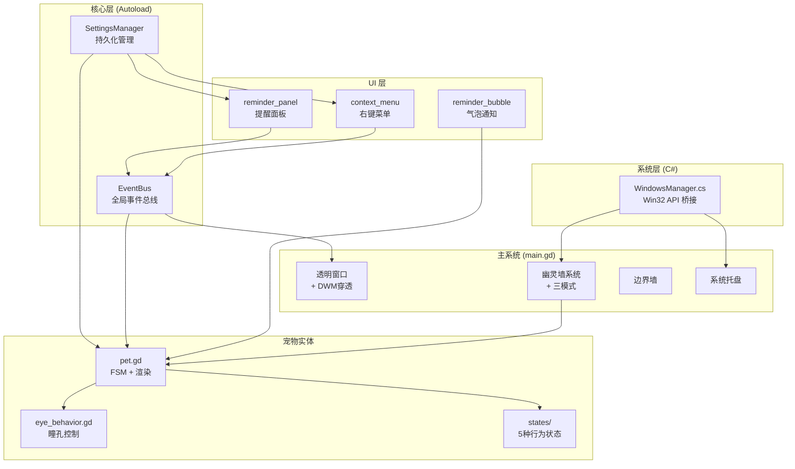

# 📐 项目架构文档

> 本文档是面向开发者的完整技术参考。如果你要参与开发或理解代码结构，从这里开始。

---

## 目录

- [一、实际目录树](#一实际目录树)
- [二、逐文件职责说明](#二逐文件职责说明)
- [三、核心架构设计](#三核心架构设计)
- [四、状态机系统](#四状态机系统)
- [五、幽灵墙与窗口交互](#五幽灵墙与窗口交互)
- [六、视觉渲染管线](#六视觉渲染管线)
- [七、通信机制](#七通信机制)
- [八、性能优化策略](#八性能优化策略)
- [九、克隆分身系统](#九克隆分身系统)

---

## 一、实际目录树

```
Desktop_Pet/
├── project.godot                   ← Godot 项目配置 (入口场景 + 渲染器 + Autoload)
├── main.tscn                       ← 启动场景 (Node2D 根节点)
├── main.gd                         ← 主系统脚本 (~900 行)
│
├── core/                           ← 核心工具层 (Autoload 全局单例)
│   ├── event_bus.gd               ← 全局事件总线 (~32 行)
│   └── settings_manager.gd       ← 持久化设置管理器 (42 行)
│
├── entities/                       ← 实体层
│   └── pet/                       ← 宠物模块
│       ├── pet.tscn               ← 宠物预制体 (RigidBody2D + CircleShape2D)
│       ├── pet.gd                 ← 宠物控制器 (~370 行)
│       ├── clone_pet.tscn         ← 克隆分身预制体 (同结构，不同脚本)
│       ├── clone_pet.gd           ← 克隆分身控制器 (~32 行，继承 pet.gd)
│       ├── eye_behavior.gd        ← 瞳孔行为控制器 (RefCounted)
│       └── states/                ← 有限状态机
│           ├── state.gd           ← PetState 基类
│           ├── idle.gd            ← 待机状态
│           ├── walk.gd            ← 行走状态
│           ├── drag.gd            ← 拖拽状态
│           ├── fall.gd            ← 掉落状态
│           ├── jump.gd            ← 高能弹跳状态
│           └── retreat.gd         ← 撤退状态 (全屏→走向屏幕边缘)
│
├── ui/                             ← 界面层
│   ├── context_menu.tscn          ← 右键菜单场景树
│   ├── context_menu.gd            ← 右键菜单逻辑 (弹性跟随 + 开关 + 模式切换)
│   ├── reminder_panel.gd          ← 提醒管理面板 (增删提醒 + 定时检查)
│   ├── reminder_bubble.gd         ← 气泡通知 (宠物头顶弹出)
│   ├── pet_chatter.gd             ← 宠物碎碎念 (每30分钟主动关怀)
│   ├── context_menu/              ← [空] 预留子场景目录
│   └── floating_text/             ← [空] 预留浮动文字特效
│
├── interop/                        ← 跨语言底层通讯 (C# / .NET)
│   └── WindowsManager.cs          ← Win32 API 桥接
│
├── scripts/                        ← [空] 预留通用脚本目录
├── builds/                         ← 编译输出 (已加入 .gitignore)
│   ├── Desktop Pet.exe            ← 导出的可执行文件 (~100MB)
│   ├── Desktop Pet.console.exe    ← 控制台版调试入口
│   ├── data_Desktop Pet_*/        ← .NET 运行时 DLL (234 个文件)
│   └── installer/                 ← Inno Setup 安装器输出目录
│
├── installer.iss                   ← Inno Setup 安装器打包脚本
├── Desktop Pet.sln                 ← .NET 解决方案文件 (Godot 自动生成)
├── Desktop Pet.csproj              ← C# 项目文件 (Godot 自动生成)
├── export_presets.cfg              ← Godot 导出预设配置
├── docs/                           ← 开发文档目录
├── AI_CONTEXT.md                   ← AI 辅助开发上下文
└── README.md                       ← 项目介绍
```

---

## 二、逐文件职责说明

### 🏠 根目录文件

| 文件 | 类型 | 职责 |
|------|------|------|
| `project.godot` | 配置 | Godot 项目的核心配置文件，定义了入口场景、渲染器 (Compatibility/OpenGL)、Autoload 注册、窗口透明设置等。**通过编辑器的「项目设置」修改，不要手动编辑** |
| `main.tscn` | 场景 | 启动场景，仅包含一个 `Node2D` 根节点并挂载 `main.gd` 脚本 |
| `main.gd` | 脚本 | **项目最核心的脚本 (~1100 行)**，承担了以下所有职责：透明窗口初始化 → 屏幕边界墙创建 → 宠物实例化 → DWM 鼠标穿透管理 (Win32 CombineRgn 多矩形区域) → 幽灵墙系统 (Win32 窗口感知) → 窗口交互三模式 (FREE/CONFINED/REPELLED) → 行为指令系统 (自由/安静+全屏自动检测) → 克隆分身系统 (召唤/遣散/持久化) → 提醒系统挂载 → 系统托盘 → 告别退出动画 |
| `Desktop Pet.sln` | 配置 | .NET 解决方案文件，Godot 在首次构建 C# 时自动生成 |
| `Desktop Pet.csproj` | 配置 | C# 项目文件，定义了 .NET 8.0 目标框架 |
| `export_presets.cfg` | 配置 | Godot 导出预设，记录了 Windows Desktop 平台的导出配置 |

### ⚙️ `core/` — Autoload 全局单例层

这两个文件在 `project.godot` 中注册为 Autoload，整个项目的任何脚本都能直接通过类名访问。

| 文件 | 行数 | 职责 |
|------|------|------|
| `event_bus.gd` | ~36 | **全局事件总线**。声明了 15 个信号用于模块间解耦通信，覆盖拖拽、状态变化、UI 控制、系统功能、窗口模式切换、行为指令切换、全屏锁定、克隆系统 (clone_pet/dismiss_clones) 等类别。所有信号发射和监听通过 `EventBus.信号名` 进行 |
| `settings_manager.gd` | 42 | **持久化设置管理器**。基于 Godot 的 `ConfigFile` API，将用户偏好 (开关状态、窗口模式、行为模式、克隆体数量) 和提醒数据以 INI 格式保存到 `user://settings.cfg`。提供 `get_bool/set_bool`、`get_int/set_int`、`get_reminders/save_reminders` 接口 |

### 🐾 `entities/pet/` — 宠物实体模块

| 文件 | 行数 | 职责 |
|------|------|------|
| `pet.tscn` | — | 宠物预制体场景。根节点为 `RigidBody2D`，包含一个 `CircleShape2D` (半径 30px) 子节点作为碰撞形状 |
| `pet.gd` | ~370 | **宠物核心控制器**。管理 FSM 状态机调度、输入事件路由、全息拖影/冲击波特效系统、科幻单眼渲染 (外壳 + 虹膜 + 瞳孔)。维护行为指令状态和克隆标记 (`is_clone`/`clone_hue_shift`)。克隆体通过 `_shift_color()` HSV 色偏实现差异化外观 |
| `clone_pet.tscn` | — | 克隆分身预制体。与 `pet.tscn` 结构一致，但挂载 `clone_pet.gd` 脚本 |
| `clone_pet.gd` | ~32 | **克隆分身控制器**，继承 `pet.gd`。覆写 4 个方法实现功能裁剪：`_input()` 恢复拖拽但屏蔽右键菜单、`_init_hud_clock()` 隐藏 HUD 时钟、`_on_setting_toggled()` 忽略原体专属设置。克隆体完全自治，拥有独立的状态机和物理碰撞 |
| `eye_behavior.gd` | ~98 | **瞳孔行为控制器** (继承 `RefCounted`，不是 Node)。管理两种瞳孔模式: 鼠标追踪 (12x 速率锁定) → 好奇游走 (鼠标静止 2.5s 后自主漫游/追踪关闭时始终游走)。任何模式下都保持追踪鼠标。同时管理机械虹膜眨眼动画: 每 2.5~7s 触发一次，20% 概率连眨 |

### 🎭 `entities/pet/states/` — 有限状态机

所有状态继承自 `PetState` 基类 (RefCounted)，实现 5 个标准接口: `enter()`, `exit()`, `process()`, `physics_process()`, `input()`。

| 文件 | 行为描述 |
|------|---------|
| `state.gd` | 基类。定义接口契约和 `pet` 引用 |
| `idle.gd` | 极短待机 (0.3~1.5s)，结束时 60% 转 Walk，40% 触发 Jump。安静模式下检测是否到达边缘，未到位则重新触发 Retreat |
| `walk.gd` | 以扩矩 (80000) 为主驱动力 + 极低平移力辅助，通过高线性阻尼 (1.5) 让摩擦力将扭矩转化为真实滚动位移 |
| `drag.gd` | 弹簧力公式 `F = k·x - c·v` 让宠物弹性跟随鼠标，同时降低重力影响 |
| `fall.gd` | 自由落体下坠，触底且速度平稳后转 Idle。安静模式下 (全屏/手动) 落地后自动重新触发 Retreat |
| `jump.gd` | 给予极大向上随机倾斜冲量 + 几万量级的超级扭矩，产生暴力弹射效果 |
| `retreat.gd` | 全屏检测或手动安静待命触发时自动滚向最近屏幕边缘，接近目标时减速刹车。到达后设 `fullscreen_locked` 启用窗口级鼠标穿透 |

### 🎨 `ui/` — 界面层

| 文件 | 职责 |
|------|------|
| `context_menu.tscn` | 右键菜单的场景树定义，包含 ◉/○ 开关按钮 (眼球追踪/冲击波/自启动/碎碎念)、窗口模式三态切换按钮、提醒管理入口、退出按钮 |
| `context_menu.gd` | 菜单 UI 逻辑。实现弹性跟随宠物 (Lerp)、以宠物为中心的 Q 弹展开/收缩动画、自定义浮动 Tooltip、启动时从 SettingsManager 恢复开关状态、窗口模式三态循环切换、碎碎念三态切换 (关闭/30分钟/60分钟)、开机自启动注册表操作、告别退出 (调用 main.gd.quit_with_farewell) |
| `reminder_panel.gd` | 提醒管理面板 (CanvasLayer)。带高度限定滚动的卡片式列表 UI、添加/删除/启用禁用提醒、纯文字药丸按钮支持每日与单次两种模式切换、一次性提醒触发后自动删除、每 10 秒检查系统时间 |
| `reminder_bubble.gd` | 气泡通知 (CanvasLayer)。宠物头顶弹出金色边框消息气泡，弹簧动画弹入 → 6 秒后淡出上飘。支持消息队列 (最多缓存 3 条，间隔 1 秒依次播放)。通过 `pet.overlay_rect` 注册到 DWM 穿透多边形 |
| `pet_chatter.gd` | 宠物碎碎念 (Node)。对齐系统时钟的整点/半点触发，支持 30/60 分钟两档切换。话术按时段分组 (时段话术每天只触发一次)，记忆最近 5 条避免重复，全屏锁定时暂停 |

### 🌉 `interop/` — C# 系统桥接层

> ⚠️ 此目录下的代码脱离了 Godot 沙盒，直接调用 Windows 系统 API。

| 文件 | 职责 |
|------|------|
| `WindowsManager.cs` | 通过 `[DllImport]` 绑定 `user32.dll`、`dwmapi.dll`、`kernel32.dll` 和 .NET `Registry` API。提供 5 个核心方法: **GetVisibleWindowRects()** (枚举窗口 + 隐形桌面/UWP覆盖层严格黑名单 + `WS_EX_TOOLWINDOW` 工具层过滤 + DWMWA_CLOAKED 过滤 + Z-Order 遮挡剔除) / **HideFromTaskbar()** (推 WS_EX_TOOLWINDOW) / **BoostProcessPriority()** / **IsAutoStartEnabled() + SetAutoStart()** / **IsUserInFullscreen()** |

---

## 三、核心架构设计

### 整体分层



### 启动流程


---

## 四、状态机系统

### 状态流转图


### FSM 实现细节

- **状态对象**：继承 `RefCounted`（不是 Node），轻量级无场景树开销
- **注册机制**：`pet.gd._init_states()` 中通过 `preload` 加载所有状态脚本并实例化到 `states: Dictionary`
- **切换机制**：`pet.transition_to("state_name")` → 调用 `old.exit()` → 切换引用 → 调用 `new.enter()` → 发射 `pet_state_changed` 信号
- **幂等保护**：如果目标状态与当前状态相同，直接 return

---

## 五、幽灵墙与窗口交互

### 窗口感知流程

1. C# 层 `EnumWindows` 按 Z-Order 遍历所有桌面窗口
2. 过滤条件：可见 + 非最小化 + 非 DWMWA_CLOAKED + 有效尺寸
3. 返回 `Array[Rect2i]` (桌面坐标系)
4. GDScript 每 0.1 秒转换为本地坐标并同步物理碰撞体

### 分段裁剪算法

每条踏板的完整宽度会被 Z-Order 更高的窗口逐一扣除，产生 1~3 个可见分段：

```
窗口A (Z低):  |=============|
窗口B (Z高):      |~~~|
实际踏板:     |===|    |====|  ← 两个分段
```

宽度不足 30px 的碎片分段会被丢弃（宠物站不稳）。

### 三种窗口交互模式

| 模式 | 碰撞体类型 | 宠物行为 |
|------|-----------|---------|
| FREE (自由漫游) | 顶/底单向踏板 | 自由站在窗口边缘，可以跳上跳下 |
| CONFINED (窗口封闭) | Union-Find 分组合并 + AABB边界建墙 + 虚空碎片积木填充 | 将相交窗口合并为“大框”，在整体外部建墙，并在“大框”内部未覆盖任何窗口的拐角用闲置的碰撞体积木死死填满，宠物能在合并区域内部自由移动但无法穿透边界或角落 |
| REPELLED (窗口排斥) | 单向碰撞体方向外翻 (四面单向) | 顶部踏脚，底部掉出，左右墙设为 `PI/2` 与 `-PI/2`；外面视为禁区进不来，但如果不小心从屏幕边界落入内部则可以直接穿透离开窗口 |

---

## 六、视觉渲染管线

所有视觉效果在 `pet.gd._draw()` 中通过 Godot 的 Canvas 绘图 API 实时渲染：

```
绘制顺序 (后绘制的在上层):
1. 冲击波光环 (draw_arc, HSV 虹彩色)
2. 全息光带拖影 (draw_circle + draw_polyline_colors, 15 段 HSV 渐变)
3. 湛蓝主外壳及边缘深色轮廓 (draw_circle × 2)
4. 极细白色前置边框环 (draw_arc)
5. 带有外延尖角的机械底座 (draw_polygon 绘制十字叶片 + draw_circle 绘制内盘)
6. 会眨眼的四级渐变虹膜 (灰白 → 灰蓝 → 深蓝 → 极暗核, 随 iris_scale 缩放)
7. 具有内外双核层次的高光点 (draw_circle × 2, 位置由 EyeBehavior 控制)
```

**按需重绘优化**：只在满足以下任一条件时才调用 `queue_redraw()`：
- 物理速度 > 1.0 (正在运动)
- 拖影粒子正在增减
- 冲击波正在扩散
- 眼球动画正在播放 (追踪/游走/眨眼)

---

## 七、通信机制

### EventBus 信号一览

| 信号 | 参数 | 发射方 → 监听方 |
|------|------|----------------|
| `drag_started` | 无 | drag.gd → main.gd (开启全屏穿透) |
| `drag_ended` | 无 | drag.gd → main.gd (恢复穿透区域) |
| `pet_state_changed` | old: String, new: String | pet.gd → (广播) |
| `show_context_menu` | target: Node2D | pet.gd → context_menu.gd |
| `context_menu_toggled` | is_open: bool | context_menu.gd → main.gd |
| `setting_toggled` | id: String, is_on: bool | context_menu.gd → pet.gd |
| `autostart_toggled` | is_on: bool | context_menu.gd → main.gd |
| `show_reminder_panel` | 无 | context_menu.gd → reminder_panel.gd |
| `show_reminder_bubble` | message: String | reminder_panel.gd → reminder_bubble.gd |
| `window_mode_changed` | mode: int | context_menu.gd → main.gd |
| `behavior_mode_changed` | mode: int | context_menu.gd / main.gd → pet.gd, context_menu.gd |
| `fullscreen_locked_changed` | locked: bool | retreat.gd → main.gd (切换窗口级穿透) |
| `ipc_message_received` | data: Dictionary | [预留] WebSocket → (广播) |
| `task_completed` | name: String | [预留] |

### 右键菜单设置项

| 菜单项 | setting_id | 控制目标 | 持久化 |
|--------|-----------|---------|--------|
| 眼睛跟随鼠标 | `eye_track` | `EyeBehavior.tracking_enabled` | ✅ ConfigFile |
| 撞击冲击波 | `shockwave` | `pet.shockwave_enabled` | ✅ ConfigFile |
| 开机自启动 | — | `HKCU\Run` 注册表 | ✅ 注册表 |
| 窗口模式 | `window_mode` | 三态循环 (FREE → CONFINED → REPELLED) | ✅ ConfigFile |
| 行为指令 | `behavior_mode` | 二态循环 (🏃 自由行动 → 🧘 安静待命) | ✅ ConfigFile |
| 宠物碎碎念 | `pet_chatter_mode` | 三态循环 (关闭 → 30分钟 → 60分钟) | ✅ ConfigFile |
| ⏰ 提醒管理... | — | 打开 reminder_panel | ✅ ConfigFile |

---

## 八、性能优化策略

| 优化项 | 实现位置 | 机制 | 效果 |
|--------|---------|------|------|
| DWM 穿透限流 | `main.gd._process()` | 16ms 时间节流 + 8px 空间量化 | 渲染跑 120fps，DWM 重组合降至 ~60hz |
| 帧率锁定 | `main.gd._ready()` | `max_fps=120` + `physics_ticks=120` | 统一渲染和物理帧率 |
| 按需重绘 | `pet.gd._process()` | 只在运动/特效/眼球动画时 `queue_redraw()` | 静止时 0 绘制开销 |
| 进程提权 | `WindowsManager.cs` | `SetPriorityClass(ABOVE_NORMAL)` | 对抗游戏等抢占 CPU 资源的应用 |
| 淡出防裁剪 | `context_menu.gd` | 关闭动画结束后才发 `toggled(false)` | 防止 DWM 中途裁剪动画 |
| 覆盖层穿透 | `reminder_bubble.gd` | 气泡区域注册到 `pet.overlay_rect` | 气泡不被 DWM 穿透裁剪 |
| 窗口隐身启动 | `main.gd._ready()` | `visible=false` → 设置 → 5帧等待 → `visible=true` → `HideFromTaskbar` (三步法) | 防止任务栏图标闪烁 |
| 任务栏样式守护 | `main.gd` | `EnsureHiddenFromTaskbar()` 每 5秒自检 | 防止引擎焦点变化时重置 WS_EX_TOOLWINDOW |
| 碰撞体对象池 | `main.gd` | 幽灵墙和虚空填充使用预分配对象池 | 避免每帧创建/销毁 StaticBody2D |

---

## 附录：关键概念映射 (前端 → Godot)

如果你有前端开发背景，以下对照表帮助快速理解 Godot 的概念：

| 前端概念 | Godot 对应 | 说明 |
|---------|-----------|------|
| HTML 元素 | **Node (节点)** | 一切皆节点，构成树形层级 |
| Vue 组件 `.vue` | **Scene (场景) `.tscn`** | 可复用的节点树模板 |
| `<script>` | **GDScript `.gd`** | 挂载在节点上的脚本 |
| `package.json` | **`project.godot`** | 项目配置的核心文件 |
| Pinia Store | **Autoload** | 全局单例 (如 EventBus、SettingsManager) |
| `emit()` / `$emit()` | **Signal (信号)** | Godot 的事件系统 |
| CSS 动画 | **`_draw()` + `queue_redraw()`** | 每帧用代码绘制图形 |
| `requestAnimationFrame()` | **`_process(delta)`** | 每帧调用 (渲染帧) |
| 无对应 | **`_physics_process(delta)`** | 每物理帧调用 (固定 120fps) |
| DOM 树 | **Scene Tree (场景树)** | 节点的父子层级结构 |

---

## 九、克隆分身系统

### 架构概览

克隆系统允许用户通过右键菜单召唤最多 **5 个分身**（总计 6 个宠物实例），所有分身拥有独立的状态机和物理碰撞，在桌面上自主行动并互相弹撞。

```
main.gd (管理层)
  ├── pet_instance  → pet.tscn / pet.gd   (原体, 唯一)
  ├── pet_instances[1] → clone_pet.tscn / clone_pet.gd (分身1)
  ├── pet_instances[2] → clone_pet.tscn / clone_pet.gd (分身2)
  └── ...最多 pet_instances[5]
```

### 继承关系

```
pet.gd (原体控制器 ~370 行)
  └── clone_pet.gd (分身控制器 ~32 行, extends pet.gd)
       覆写: _ready(), _input(), _init_hud_clock(), _on_setting_toggled()
```

**设计原则**：通过继承+覆写实现功能裁剪，未来给 `pet.gd` 新增的功能（如新 HUD、新交互）默认 **不会** 泄漏到克隆体，除非显式在 `clone_pet.gd` 中调用 `super`。

### 原体 vs 克隆体 功能对比

| 功能 | 原体 (pet.gd) | 克隆体 (clone_pet.gd) |
|------|:---:|:---:|
| 物理碰撞 (RigidBody2D) | ✅ | ✅ |
| 状态机 (Idle/Walk/Jump/Fall/Retreat/Drag) | ✅ | ✅ |
| 眼球追踪 + 眨眼 | ✅ | ✅ |
| 全息拖影 + 冲击波 | ✅ | ✅ (偏色) |
| 鼠标拖拽 | ✅ | ✅ |
| 右键菜单 | ✅ | ❌ |
| HUD 全息时钟 | ✅ | ❌ |
| 气泡通知绑定 | ✅ | ❌ |
| 碎碎念系统绑定 | ✅ | ❌ |
| 全屏锁定信号发射 | ✅ | ❌ (自身锁定但不触发全局) |

### DWM 多矩形穿透方案

**核心挑战**：Godot 的 `window_set_mouse_passthrough()` 内部调用 `CreatePolygonRgn`，只支持单多边形。多个分散的宠物会导致一个巨大的 AABB 阻挡桌面点击。

**解决方案**：绕过 Godot API，通过 C# 层直接操作 Win32 GDI Region：

```
GDScript main.gd → win_manager.call("SetWindowRegion", rects)
  ↓
C# WindowsManager.SetWindowRegion(Array<Rect2I>)
  → CreateRectRgn() × N      (为每个宠物创建独立矩形)
  → CombineRgn(RGN_OR) × (N-1)  (联合合并)
  → SetWindowRgn()            (一次性应用)
```

效果：每个宠物拥有独立的小渲染/交互区域，宠物之间的间隙完全穿透到桌面。

### 生命周期

```
启动 → _spawn_pet() 创建原体 → 读取 SettingsManager("clone_count")
  → _clone_pet() × N 静默恢复分身

右键菜单 "🧬 召唤分身" → EventBus.clone_pet → _clone_pet()
  → clone_scene.instantiate() → 设置色偏/位置 → add_child()
  → pet_instances.append() → SettingsManager.set_int("clone_count")

右键菜单 "💨 遣散所有分身" → EventBus.dismiss_clones → _on_dismiss_clones_requested()
  → freeze + collision_layer=0 + 缩放淡出动画 → queue_free()
  → SettingsManager.set_int("clone_count", 0)

告别退出 quit_with_farewell()
  → 所有克隆体: freeze + 禁碰 + 缩放淡出 + queue_free()
  → 原体: 等落地 → 等气泡 → 滚出屏幕 → quit()
```

### 5 种预设色调

| 序号 | HSV Hue 偏移 | 视觉效果 |
|:---:|:---:|:---:|
| 1 | 0.75 | 紫色系 |
| 2 | 0.45 | 青色系 |
| 3 | 0.12 | 琥珀色系 |
| 4 | 0.35 | 翠绿色系 |
| 5 | 0.85 | 玫瑰色系 |

### 关键信号流

```
EventBus.clone_pet(source: Node2D)    → main._on_clone_pet_requested()
EventBus.dismiss_clones               → main._on_dismiss_clones_requested()
EventBus.fullscreen_locked_changed     → 仅原体 emit (clone 中 is_clone 守卫)
EventBus.setting_toggled("hud_clock")  → clone_pet.gd 覆写忽略
```

