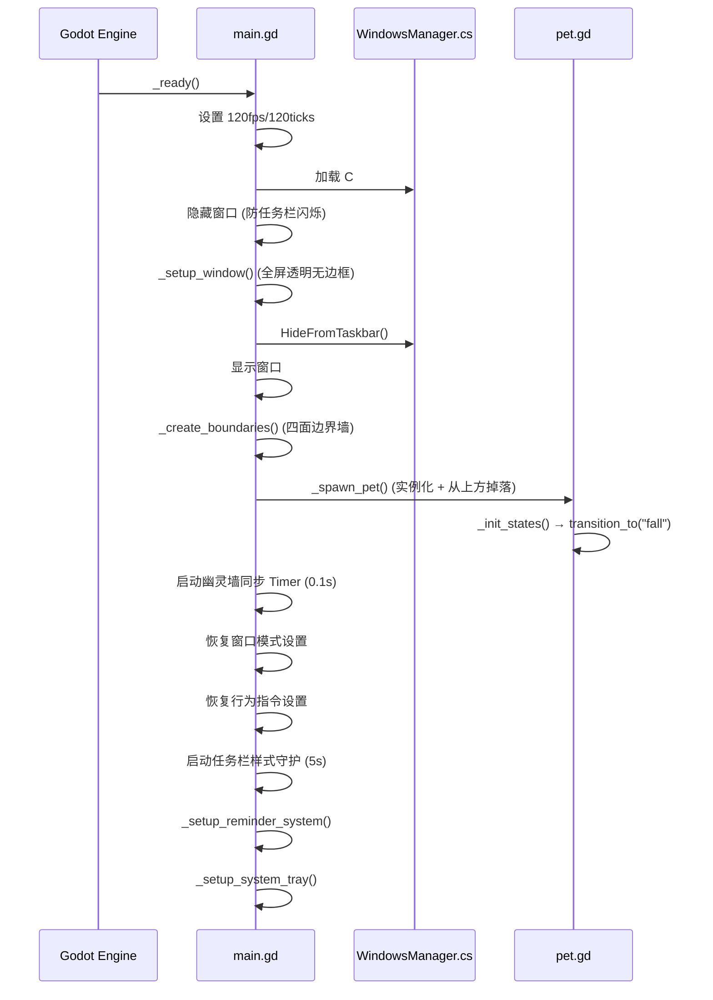
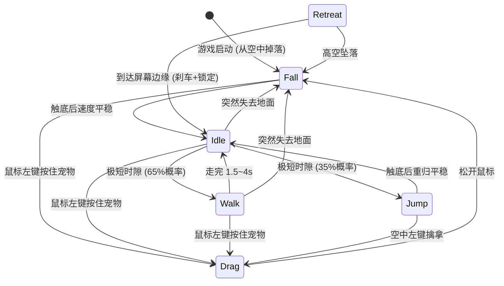

# 📐 项目架构文档

> 本文档是面向开发者的完整技术参考。如果你要参与开发或理解代码结构，从这里开始。

---

## 目录

- [一、实际目录树](#一实际目录树)
- [二、逐文件职责说明](#二逐文件职责说明)
- [三、核心架构设计](#三核心架构设计)
- [四、状态机系统](#四状态机系统)
- [五、幽灵墙与窗口交互](#五幽灵墙与窗口交互)
- [六、视觉渲染管线](#六视觉渲染管线)
- [七、通信机制](#七通信机制)
- [八、性能优化策略](#八性能优化策略)
- [九、克隆分身系统](#九克隆分身系统)

---

## 一、实际目录树

```
Desktop_Pet/
├── project.godot                   ← Godot 项目配置 (入口场景 + 渲染器 + Autoload)
├── main.tscn                       ← 启动场景 (Node2D 根节点)
├── main.gd                         ← 主系统脚本 (~285 行)
│
├── core/                           ← 核心工具层 (Autoload + 子管理器)
│   ├── event_bus.gd               ← 全局事件总线 (~44 行)
│   ├── settings_manager.gd       ← 持久化设置管理器 (~88 行)
│   ├── clone_manager.gd          ← 克隆与行为管理器 (~160 行)
│   ├── farewell_manager.gd       ← 告别退出 + 退场动画 (~173 行)
│   ├── ghost_wall_manager.gd     ← 幽灵墙管理器 (~270 行)
│   └── hit_region_manager.gd     ← DWM 穿透管理器 (~285 行, 引用计数互斥)
│
├── entities/                       ← 实体层
│   └── pet/                       ← 宠物模块
│       ├── pet.tscn               ← 宠物预制体 (RigidBody2D + CircleShape2D)
│       ├── pet.gd                 ← 宠物核心控制器 (~280 行)
│       ├── poke_system.gd         ← 戳一戳交互系统 (RefCounted, ~171 行)
│       ├── pet_hud.gd             ← 本地气泡管理器 (RefCounted, ~133 行)
│       ├── hud_panel.gd           ← 统一 HUD 悬浮面板 (RefCounted, ~330 行)
│       ├── pet_effects.gd         ← 视觉特效管理器 (RefCounted, ~100 行)
│       ├── pet_color_palette.gd   ← 宠物调色板 (RefCounted, ~46 行)
│       ├── clone_pet.tscn         ← 克隆分身预制体 (同结构，不同脚本)
│       ├── clone_pet.gd           ← 克隆分身控制器 (~29 行，继承 pet.gd)
│       ├── eye_behavior.gd        ← 瞳孔行为控制器 (RefCounted, ~193 行)
│       └── states/                ← 有限状态机
│           ├── state.gd           ← PetState 基类
│           ├── idle.gd            ← 待机状态
│           ├── walk.gd            ← 行走状态
│           ├── drag.gd            ← 拖拽状态
│           ├── fall.gd            ← 掉落状态
│           ├── jump.gd            ← 高能弹跳状态
│           └── retreat.gd         ← 撤退状态 (安静待命→走向屏幕边缘)
│
├── ui/                             ← 界面层
│   ├── context_menu.tscn          ← 右键菜单场景树
│   ├── context_menu.gd            ← 右键菜单主控制器 (~725行, 委托 5 个子系统)
│   ├── context_menu/              ← 右键菜单子系统 (RefCounted)
│   │   ├── info_sidebar.gd        ← 信息侧栏 (~176行)
│   │   ├── sysinfo_bubble.gd      ← 系统信息气泡 (~140行)
│   │   ├── submenu_system.gd      ← 级联子菜单 (~237行)
│   │   ├── menu_tooltip.gd        ← 浮动提示 (~78行)
│   │   └── section_styler.gd      ← 分区徽章样式化 (~89行)
│   ├── reminder_panel.gd          ← 提醒管理面板 (增删提醒 + 定时检查)
│   ├── reminder_bubble.gd         ← 气泡通知 (宠物头顶弹出)
│   ├── pet_chatter.gd             ← 宠物碎碎念 (每30分钟主动关怀)
│   ├── theme_panel.gd             ← 外观主题面板 (色轮+目标选择+预设, ~530 行)
│   └── floating_text/             ← [空] 预留浮动文字特效
│
├── interop/                        ← 跨语言底层通讯 (C# / .NET)
│   └── WindowsManager.cs          ← Win32 API 桥接
│
├── scripts/                        ← [空] 预留通用脚本目录
├── dist/                           ← 分发/发布包输出目录
├── builds/                         ← 编译输出 (已加入 .gitignore)
│   ├── Desktop Pet.exe            ← 导出的可执行文件 (~100MB)
│   ├── Desktop Pet.console.exe    ← 控制台版调试入口
│   ├── data_Desktop Pet_*/        ← .NET 运行时 DLL (234 个文件)
│   └── installer/                 ← Inno Setup 安装器输出目录
│
├── installer.iss                   ← Inno Setup 安装器打包脚本
├── Desktop Pet.sln                 ← .NET 解决方案文件 (Godot 自动生成)
├── Desktop Pet.csproj              ← C# 项目文件 (Godot 自动生成)
├── export_presets.cfg              ← Godot 导出预设配置
├── docs/                           ← 开发文档目录
└── README.md                       ← 项目介绍
```

---

## 二、逐文件职责说明

### 🏠 根目录文件

| 文件 | 类型 | 职责 |
|------|------|------|
| `project.godot` | 配置 | Godot 项目的核心配置文件，定义了入口场景、渲染器 (Compatibility/OpenGL)、Autoload 注册、窗口透明设置等。**通过编辑器的「项目设置」修改，不要手动编辑** |
| `main.tscn` | 场景 | 启动场景，仅包含一个 `Node2D` 根节点并挂载 `main.gd` 脚本 |
| `main.gd` | 脚本 | **启动调度器 (~285 行)**。精简后只负责：透明窗口初始化 → 屏幕边界墙创建 → 宠物实例化 → 四个子管理器编排 (`ghost_wall_manager` / `hit_region_manager` / `clone_manager` / `farewell_manager`) → 提醒系统/碎碎念挂载 → 系统托盘 → 任务栏守护。对外暴露 `quit_with_farewell()` 和 `reorganize_quiet_queue()` 代理方法兼容外部调用 |
| `Desktop Pet.sln` | 配置 | .NET 解决方案文件，Godot 在首次构建 C# 时自动生成 |
| `Desktop Pet.csproj` | 配置 | C# 项目文件，定义了 .NET 8.0 目标框架 |
| `export_presets.cfg` | 配置 | Godot 导出预设，记录了 Windows Desktop 平台的导出配置 |

### ⚙️ `core/` — 全局单例 + 子管理器层

`event_bus.gd` 和 `settings_manager.gd` 在 `project.godot` 中注册为 Autoload，整个项目可直接通过类名访问。四个子管理器由 `main.gd` 在 `_ready()` 中通过 `Script.new()` 实例化并挂载为子节点。

| 文件 | 行数 | 职责 |
|------|------|------|
| `event_bus.gd` | ~44 | **全局事件总线**。声明了 19 个信号用于模块间解耦通信，覆盖拖拽、状态变化、UI 控制、系统功能、窗口模式、行为指令、克隆系统、颜色系统 (`pet_color_changed`/`ui_theme_changed`/`show_theme_panel`) 等类别。持有 `ui_hue` 全局可读变量 (UI 主题色) |
| `settings_manager.gd` | ~88 | **持久化设置管理器**。基于 Godot 的 `ConfigFile` API，将用户偏好和提醒数据以 INI 格式保存到 `user://settings.cfg`。**类型分离存储**: bool 存 `switches` section、int 存 `values` section、提醒存 `reminders` section、颜色存 `colors` section (per-pet H/S/V + ui_hue) |
| `ghost_wall_manager.gd` | ~270 | **幽灵墙管理器** (从 main.gd 拆分)。每 0.1s 通过 C# 层获取 Win32 窗口矩形，根据当前模式建墙: FREE / CONFINED / REPELLED。监听 `anti_gravity` 设置变更实时切换 |
| `hit_region_manager.gd` | ~285 | **DWM 穿透管理器** (从 main.gd 拆分)。**双模式架构**: 完美穿透模式 (WS_EX_TRANSPARENT) / SetWindowRgn 回退模式。**引用计数互斥**: `_menu_open_count` 解决多面板 (菜单/提醒/主题) 时序竞争导致穿透失效 |
| `clone_manager.gd` | ~160 | **克隆与行为管理器** (从 main.gd 拆分)。管理克隆体生命周期 (召唤/随机避撞色分配/颜色持久化)、安静待命排队、行为指令切换。每个克隆体拥有独立的 `PetColorPalette` 实例，通过 `_generate_distinct_hue()` 确保色调间距 ≥ 29° |
| `farewell_manager.gd` | ~173 | **告别退出管理器** (从 clone_manager.gd 拆分)。管理遣散克隆体和优雅退出流程。提供公共 `animate_exit()` 退场动画 (滚向屏幕边缘+旋转+淡出)，消除遣散/退出的代码重复。遣散时使用 `force_show_bubble` 清空旧气泡队列 |

### 🐾 `entities/pet/` — 宠物实体模块

| 文件 | 行数 | 职责 |
|------|------|------|
| `pet.tscn` | — | 宠物预制体场景。根节点为 `RigidBody2D`，包含一个 `CircleShape2D` (半径 30px) 子节点作为碰撞形状 |
| `pet.gd` | ~280 | **宠物核心控制器**。管理 FSM 状态机调度、输入事件路由、科幻单眼渲染。通过 5 个 RefCounted 子系统委托各职责: `PokeSystem` (戳一戳)、`PetHUD` (本地气泡)、`HudPanel` (统一 HUD 悬浮面板)、`PetEffects` (冲击波+拖影)、`EyeBehavior` (瞳孔)。设置开关通过 `EventBus.setting_toggled` 同步到各子系统。每帧转发鼠标悬浮状态至 HUD 面板。**反重力系统**: `gravity_sign` 符号乘数统一控制所有垂直冲量方向。**步态系统**: `move_style` (0=蹦跳/1=滚动/2=混合) 控制 idle/walk 状态的移动概率分布 |
| `poke_system.gd` | ~171 | **戳一戳交互系统** (RefCounted，从 pet.gd 拆分)。管理全部话术常量和交互逻辑。优先级路由: 未确认提醒 → 未确认碎碎念 → 连戳递进吐槽 → 久别重逢 (30分钟/1小时/3小时三档) → 深夜关怀 (23:00~5:00) → 普通话术 |
| `pet_hud.gd` | ~133 | **本地气泡管理器** (RefCounted)。管理本地定向气泡 (每宠物独立堆叠，最多3条，弹簧弹入+淡出上飘)。反重力时气泡改为向下堆叠。时钟已迁移至 `hud_panel.gd` 统一管理 |
| `hud_panel.gd` | ~330 | **统一 HUD 悬浮面板** (RefCounted)。宠物侧边悬浮的实时信息卡片。当前组件: 系统时钟 + WiFi SSID 显示。**双显示模式**: 常驻模式 (`hud_pin`) 面板始终可见；悬浮模式 (默认) 鼠标悬停宠物时淡入、离开后 0.3 秒延迟淡出。WiFi 通过 `WorkerThreadPool` 后台查询零卡顿，15秒刷新。点击 WiFi 行直接打开 Windows 网络设置。智能定位: 宠物在右半屏→面板放左边。右键菜单打开时自动淡出避让。各组件独立开关，全部关闭时面板自动隐藏。两行布局统一为 `[●标签列(38px)] + [值文本(17px)]` 结构确保对齐 |
| `pet_effects.gd` | ~195 | **视觉特效管理器** (RefCounted，从 pet.gd 拆分)。管理冲击波、全息拖影和能量共鸣弧。**双配色模式**: 虹彩 (彩虹循环, 默认) / 跟随体色 (纯色)。**能量共鸣弧**: 多宠物距离<150px时自动绘制锯齿状闪电弧，双色渐变辉光+白色内核，随机放电闪烁。颜色通过 `palette.effective_hue()` 联动 |
| `pet_color_palette.gd` | ~46 | **宠物调色板** (RefCounted)。基于 HSV Hue Delta 的色彩变换核心。记录 `hue` (0~1) 和 `sat_scale`/`val_scale` 缩放因子。提供 `shift_color(base)` 将硬编码模板色偏移至目标色调，`effective_hue()` 返回当前绝对色调。支持角度制/百分比设取。默认 hue=0.62 (原始蓝色) |
| `clone_pet.tscn` | — | 克隆分身预制体。与 `pet.tscn` 结构一致，但挂载 `clone_pet.gd` 脚本 |
| `clone_pet.gd` | ~34 | **克隆分身控制器**，继承 `pet.gd`。覆写 2 个方法实现功能裁剪。克隆体不显示 HUD 面板 |
| `eye_behavior.gd` | ~193 | **瞳孔行为控制器** (RefCounted)。三种瞳孔模式 + 机械虹膜眨眼动画。按需重绘 |

### 🎭 `entities/pet/states/` — 有限状态机

共 **6 种**状态，所有状态继承自 `PetState` 基类 (RefCounted)，实现 5 个标准接口: `enter()`, `exit()`, `process()`, `physics_process()`, `input()`。

| 文件 | 行为描述 |
|------|---------|
| `state.gd` | 基类。定义接口契约和 `pet` 引用 |
| `idle.gd` | 待机 (1.0~4.0s)，结束时根据步态风格调整 Walk/Jump 概率: 蹦跳为主 85%/15%、滚动为主 100%/0%、混合平衡 90%/10%。注视同伴时不跳动。散步者接近时被动跳开让路。安静模式下精确匹配槽位坐标 |
| `walk.gd` | **步态风格驱动移动**：蹦跳为主 → 纯冲量跳跃；滚动为主 → 100% 短距滚动 (120~300px，扭矩 15000，前方 80px 同伴避让)；混合平衡 → 50%/50%。**自主巡航特殊事件** (独立开关): 8% 概率触发长距滚动到对面边缘，推开前方 140px 内同伴让路。含 0.8s 卡死检测 |
| `drag.gd` | 弹簧力公式 `F = k·x - c·v` 让宠物弹性跟随鼠标，同时降低重力影响。松手时判定「戳一戳 (Poke)」(拖拽 < 0.25s + 移动 < 12px) 委托至 `pet.handle_poke()` 优先级路由系统 |
| `fall.gd` | 自由落体/上升 (尊重 `gravity_sign` 恢复正确的 `gravity_scale`)，稳定后转 Idle。安静模式下落地后自动发起全局阵列重排，并重新转入 Retreat 归队 |
| `jump.gd` | **大跳**：更高更远的抛物线冲量 (900~1500) + 适度空中翻滚 (8000~18000 扭矩冲量)，靠近边缘自动往回跳。落地稳定后回到 Idle |
| `retreat.gd` | 手动安静待命触发时，读取全局分配的专属槽位坐标（防交叠排队机制）并减速停靠 (12px 到达阈值)。到达后高阻尼刹车 (linear=5, angular=5)，最后几像素由 idle 的 lerp 柔滑对齐 (无闪现瞬移)。滚动扭矩乘 `gravity_sign` 适配反重力方向。遇到物理障碍时，0.5秒内基于绝对位移精准触发防卡死保护。撤退期间支持鼠标左键拖拽打断 (松手后通过 fall→retreat 自动回归队列) |

### 🎨 `ui/` — 界面层

| 文件 | 职责 |
|------|------|
| `context_menu.tscn` | 右键菜单场景树。**分区徽章布局**: 宠物 (眼球追踪/碎碎念▸) → 显示 (HUD 面板) → 行为 (窗口/指令/模式) → 视觉 (特效/外观主题) → 玩法 (娱乐/提醒/分身) → 系统 (系统信息/自启动/休息) |
| `context_menu.gd` | 菜单主控制器 (~725行)。**双面板架构**: 主菜单 + 信息侧栏。**智能四象限定位**。通过 5 个 RefCounted 子系统委托: `_sidebar` (侧栏), `_sysinfo_bubble` (系统气泡), `_submenu` (级联子菜单), `_tooltip` (浮动提示), `_styler` (分区样式) |
| `context_menu/info_sidebar.gd` | **信息侧栏** (RefCounted, ~176行)。日期/时钟/WiFi/电池/开机时长。WiFi+电池合并一次 PS 调用，开机时长本地计算零开销。`WorkerThreadPool` 异步执行 |
| `context_menu/sysinfo_bubble.gd` | **系统信息气泡** (RefCounted, ~140行)。按需查询 CPU/GPU/RAM/Disk，NVIDIA 独显优先。宠物气泡跟随 + overlay_rect 解除穿透 |
| `context_menu/submenu_system.gd` | **级联子菜单** (RefCounted, ~237行)。开关子菜单 + 单选子菜单的创建/显隐/动画/hover 延时/位置追踪。触发按钮映射通过 `register_trigger()` 注册 |
| `context_menu/menu_tooltip.gd` | **浮动提示** (RefCounted, ~78行)。子菜单项的描述性浮动提示，智能左右侧弹出 |
| `context_menu/section_styler.gd` | **分区样式化** (RefCounted, ~89行)。将 ▌ 标题替换为彩色左边框徽章 + 子菜单边框色自动继承区块色 |
| `reminder_panel.gd` | 提醒管理面板 (CanvasLayer)。带高度限定滚动的卡片式列表 UI、添加/删除/启用禁用提醒、▲/▼ 滚轮式时间选择器 (大数字+弹跳动画)、`1×单次`/`🔁每日` 胶囊切换按钮、一次性提醒触发后自动删除、每 10 秒检查系统时间 |
| `reminder_bubble.gd` | 全局通知气泡 (CanvasLayer)。宠物头顶弹出消息气泡 (边框色跟随 UI 主题)，弹簧动画弹入 → 6 秒后淡出上飘。支持消息队列。`overlay_rect` 由 `main.gd` 注册到 DWM |
| `pet_chatter.gd` | 宠物碎碎念 (Node)。对齐系统时钟的整点/半点触发，支持 30/60 分钟两档切换 |
| `theme_panel.gd` | **外观主题面板** (CanvasLayer, ~530行)。Canvas 绘制 HSV 色轮 + 拖拽选色 + 目标选择器 (原体/分身/界面) + S/V 滑块 + 8 个预设色 + 重置。撞色检测提示 (色调距离 < 6%/10%)。面板边框实时跟随 UI 主题色。颜色变更通过 `EventBus.pet_color_changed` / `ui_theme_changed` 广播 + `SettingsManager` 持久化 |

### 🌉 `interop/` — C# 系统桥接层

> ⚠️ 此目录下的代码脱离了 Godot 沙盒，直接调用 Windows 系统 API。

| 文件 | 职责 |
|------|------|
| `WindowsManager.cs` | 通过 `[DllImport]` 绑定 `user32.dll`、`dwmapi.dll`、`gdi32.dll`、`kernel32.dll` 和 .NET `Registry` API。提供核心方法: **GetVisibleWindowRects()** (枚举窗口 + 隐形桌面/UWP覆盖层严格黑名单 + `WS_EX_TOOLWINDOW` 工具层过滤 + DWMWA_CLOAKED 过滤 + Z-Order 遮挡剔除) / **HideFromTaskbar()** (推 WS_EX_TOOLWINDOW) / **BoostProcessPriority()** / **IsAutoStartEnabled() + SetAutoStart()** / **InjectLayeredStyle()** (手动注入 `WS_EX_LAYERED` + `SetLayeredWindowAttributes(255)` 使完美穿透可行) / **SetClickThrough(bool)** (切换 `WS_EX_TRANSPARENT` 实现精确鼠标穿透) / **UpdateHitRegions()** (回退方案: GDI Region 混合形状) / **SetFullWindowHit()** (拖拽/菜单时全窗口可交互) |

---

## 三、DWM 穿透技术突破

> **自主发现**: Godot 4.x Compatibility/OpenGL 渲染器默认不设置 `WS_EX_LAYERED` 窗口样式，导致 `WS_EX_TRANSPARENT` 无法生效。互联网上所有已知的 Godot 桌面宠物穿透方案均依赖 `SetWindowRgn`，必然造成视觉裁剪。本项目通过 C# 层手动注入 `WS_EX_LAYERED` + `SetLayeredWindowAttributes(hwnd, 0, 255, LWA_ALPHA)` 解决了这一根本限制。

### 方案演进历程

| 阶段 | 方案 | 结果 |
|------|------|------|
| 1 | `SetWindowRgn` + `CreateEllipticRgn` | 功能正常，但视觉特效 (冲击波/拖影) 被裁剪 |
| 2 | `WS_EX_TRANSPARENT` 切换 | 失败 — Godot 窗口无 `WS_EX_LAYERED`，穿透不生效 |
| 3 | 双窗口特效叠加 | 失败 — Godot 多窗口机制不稳定 |
| 4 | 扩大椭圆半径包容特效 | 严重掉帧 — `CreateEllipticRgn` 大半径时 GDI 扫描线爆炸 |
| 5 | AABB 矩形包围盒 | 功能正常，无掉帧，但特效区域阻挡桌面点击 |
| 6 | 诊断发现 `WS_EX_LAYERED` 缺失 → 手动注入 | **完美** — 零裁剪 + 精确穿透 + 零性能损耗 |

### 技术原理

```
Godot 窗口 (OpenGL Compatibility)
  └── 默认 Extended Style: 0x00000098 (TOOLWINDOW + TOPMOST + ACCEPTFILES)
  └── 缺失 WS_EX_LAYERED (0x00080000)
      └── WS_EX_TRANSPARENT 无效 (需要 LAYERED 作为前提条件)

手动注入后:
  └── Extended Style: 0x00080098 (+ WS_EX_LAYERED)
  └── SetLayeredWindowAttributes(hwnd, 0, 255, LWA_ALPHA) → 全不透明
  └── Godot OpenGL 渲染不受影响 (DWM 合成层兼容)
  └── WS_EX_TRANSPARENT 切换生效 → 精确鼠标穿透
```

### 双模式架构

- **完美模式** (注入成功): 不使用 `SetWindowRgn`，零视觉裁剪。GDScript 本地检测鼠标位置，仅在进出宠物区域时切换 `WS_EX_TRANSPARENT`
- **回退模式** (注入失败): 使用 `SetWindowRgn` + AABB 矩形包围盒，保证基本功能

---

## 四、核心架构设计

### 整体分层


### 启动流程



---

## 五、状态机系统

### 状态流转图



### FSM 实现细节

- **状态对象**：继承 `RefCounted`（不是 Node），轻量级无场景树开销
- **注册机制**：`pet.gd._init_states()` 中通过 `preload` 加载所有状态脚本并实例化到 `states: Dictionary`
- **切换机制**：`pet.transition_to("state_name")` → 调用 `old.exit()` → 切换引用 → 调用 `new.enter()` → 发射 `pet_state_changed` 信号
- **幂等保护**：如果目标状态与当前状态相同，直接 return

---

## 六、幽灵墙与窗口交互

### 窗口感知流程

1. C# 层 `EnumWindows` 按 Z-Order 遍历所有桌面窗口
2. 过滤条件：可见 + 非最小化 + 非 DWMWA_CLOAKED + 有效尺寸
3. 返回 `Array[Rect2i]` (桌面坐标系)
4. GDScript 每 0.1 秒转换为本地坐标并同步物理碰撞体

### 分段裁剪算法

每条踏板的完整宽度会被 Z-Order 更高的窗口逐一扣除，产生 1~3 个可见分段：

```
窗口A (Z低):  |=============|
窗口B (Z高):      |~~~|
实际踏板:     |===|    |====|  ← 两个分段
```

宽度不足 30px 的碎片分段会被丢弃（宠物站不稳）。

### 三种窗口交互模式

| 模式 | 碰撞体类型 | 宠物行为 |
|------|-----------|---------|
| FREE (自由漫游) | 顶/底单向踏板 | 自由站在窗口边缘，可以跳上跳下 |
| CONFINED (窗口封闭) | Geometry2D.merge_polygons 多边形合并 + 动态单向线段墙 | 摒弃 AABB 包围盒，使用 Godot 原生 Clipper 算法得出多重重叠窗口的绝对不规则外边界与内孔洞。沿轮廓边缘动态铺设单向碰撞线段并反转法线，实现任意组合形状的“外部可无缝进入、内部绝对封闭”效果 |
| REPELLED (窗口排斥) | Geometry2D.merge_polygons 多边形合并 + 动态单向线段墙 (法线不反转) | 与 CONFINED 共用 `_apply_polygon_wall_mode()`，重叠窗口先合并为连通外轮廓。区别仅在 `rotation_offset=0` (不加 PI)，法线指向窗内 → 拦截向内移动，实现"外部无法进入、内部可自由离开"的排斥效果 |

---

## 七、视觉渲染管线

所有视觉效果在 `pet.gd._draw()` 中通过 Godot 的 Canvas 绘图 API 实时渲染。特效部分 (冲击波+拖影) 委托给 `pet_effects.gd.render()` 执行：

```
绘制顺序 (后绘制的在上层):
1. 冲击波光环 (draw_arc, HSV 虹彩色)                       ← pet_effects.render()
2. 全息光带拖影 (draw_circle + draw_polyline_colors, 15 段 HSV 渐变)  ← pet_effects.render()
3. 湛蓝主外壳及边缘深色轮廓 (draw_circle × 2) — 随身体旋转
4. 极细白色前置边框环 (draw_arc) — 随身体旋转
5. 带有外延尖角的机械底座 (draw_polygon + draw_circle) — 随身体旋转
── draw_set_transform(-rotation) 眼球反旋转稳定 ──
6. 眼白/巩膜 (灰白, 固定圆心) — 世界对齐，不随身体旋转
7. 虹膜三层 (灰蓝 → 深蓝 → 极暗核, 跟随 EyeBehavior 世界空间偏移)
8. 高光反射点 (固定于虹膜左上方偏移，模拟环境光泽)
── draw_set_transform(0) 恢复 ──
```

**按需重绘优化**：只在满足以下任一条件时才调用 `queue_redraw()`：
- 物理速度 > 1.0 (正在运动)
- 拖影粒子正在增减
- 冲击波正在扩散
- 眼球动画正在播放 (追踪/游走/眨眼)

---

## 八、通信机制

### EventBus 信号一览

| 信号 | 参数 | 发射方 → 监听方 |
|------|------|----------------|
| `drag_started` | 无 | drag.gd → main.gd (清除穿透区域限制) |
| `drag_ended` | 无 | drag.gd → main.gd (恢复穿透区域) |
| `pet_state_changed` | old: String, new: String | pet.gd → (广播) |
| `show_context_menu` | target: Node2D | pet.gd → context_menu.gd |
| `context_menu_toggled` | is_open: bool | context_menu.gd → main.gd |
| `setting_toggled` | id: String, is_on: bool | context_menu.gd → pet.gd |
| `autostart_toggled` | is_on: bool | context_menu.gd → main.gd |
| `show_reminder_panel` | 无 | context_menu.gd → reminder_panel.gd |
| `show_reminder_bubble` | message: String | reminder_panel.gd / pet_chatter.gd → reminder_bubble.gd (非定向，始终跟随原体) |
| `force_show_bubble` | message: String | main.gd (告别退出) → reminder_bubble.gd (中断当前+清空队列+立即播放) |
| `show_targeted_bubble` | message: String, target: Node2D | [已迁移] 定向气泡现在通过 `pet.show_local_bubble(msg)` 直接调用，每宠物独立堆叠显示，不再经过 EventBus |
| `window_mode_changed` | mode: int | context_menu.gd → main.gd |
| `behavior_mode_changed` | mode: int | context_menu.gd / main.gd → pet.gd, context_menu.gd |
| `pet_color_changed` | pet_index: int, hue, sat, val | theme_panel.gd → pet.gd (实时预览宠物颜色) |
| `ui_theme_changed` | hue: float | theme_panel.gd → context_menu.gd / submenu / sidebar / sysinfo / reminder (UI 边框色联动) |
| `show_theme_panel` | 无 | context_menu.gd → theme_panel.gd |
| `ipc_message_received` | data: Dictionary | [预留] WebSocket → (广播) |
| `task_completed` | name: String | [预留] |

### 右键菜单设置项

| 菜单项 | setting_id | 控制目标 | 持久化 |
|--------|-----------|---------|--------|
| 眼睛跟随鼠标 | `eye_track` | `EyeBehavior.tracking_enabled` | ✅ ConfigFile |
| 撞击冲击波 | `shockwave` | `pet.shockwave_enabled` | ✅ ConfigFile |
| 全息拖影 | `trail_fx` | `pet.trail_enabled` | ✅ ConfigFile |
| 能量共鸣弧 | `arc_fx` | `pet.arc_enabled` (近距离宠物间静电弧) | ✅ ConfigFile |
| 特效配色 | `effect_color_mode` | 二态单选 (虹彩模式 → 跟随体色) | ✅ ConfigFile |
| HUD 常驻显示 | `hud_pin` | `HudPanel.hud_pin` (仅原体) | ✅ ConfigFile |
| HUD 系统时钟 | `hud_clock` | `HudPanel.clock_enabled` (仅原体) | ✅ ConfigFile |
| HUD WiFi 信息 | `hud_wifi` | `HudPanel.wifi_enabled` (仅原体) | ✅ ConfigFile |
| 步态风格 | `move_style` | 三态循环 (蹦跳为主 → 滚动为主 → 混合平衡) | ✅ ConfigFile |
| 自主巡航 | `stroll` | `pet.stroll_enabled` (8% 特殊事件开关) | ✅ ConfigFile |
| 开机自启动 | — | `HKCU\Run` 注册表 | ✅ 注册表 |
| 窗口模式 | `window_mode` | 三态循环 (FREE → CONFINED → REPELLED) | ✅ ConfigFile |
| 行为指令 | `behavior_mode` | 二态循环 (🏃 自由行动 → 🧘 安静待命) | ✅ ConfigFile |
| 宠物碎碎念 | `pet_chatter_mode` | 三态循环 (关闭 → 30分钟 → 60分钟) | ✅ ConfigFile |
| ⏰ 提醒管理... | — | 打开 reminder_panel | ✅ ConfigFile |
| 外观主题... | — | 打开 theme_panel (色轮+目标+滑块+预设) | ✅ ConfigFile (colors section) |

---

## 九、性能优化策略

| 优化项 | 实现位置 | 机制 | 效果 |
|--------|---------|------|------|
| DWM 穿透限流 | `hit_region_manager.gd` | 8ms 时间节流，完美模式仅在鼠标进出宠物区域时切换 `SetWindowLong`（1次/跨越） | 零性能损耗 (不再调用 GDI Region API) |
| 帧率锁定 | `main.gd._ready()` | `max_fps=120` + `physics_ticks=120` | 统一渲染和物理帧率 |
| 按需重绘 | `pet.gd._process()` | 只在运动/特效/眼球动画时 `queue_redraw()` | 静止时 0 绘制开销 |
| 进程提权 | `WindowsManager.cs` | `SetPriorityClass(ABOVE_NORMAL)` | 对抗游戏等抢占 CPU 资源的应用 |
| 淡出防裁剪 | `context_menu.gd` | 关闭动画结束后才发 `toggled(false)` + 外部点击关闭时 `set_input_as_handled()` | 防止 DWM 中途裁剪动画 + 防止关闭点击穿透到宠物 |
| WS_EX_LAYERED 注入 | `WindowsManager.cs` | 手动注入 `WS_EX_LAYERED` + `SetLayeredWindowAttributes(255)` 使 `WS_EX_TRANSPARENT` 切换可行 | 彻底告别 `SetWindowRgn` 视觉裁剪，特效完整显示 + 精确穿透 |
| 本地气泡堆叠 | `pet_hud.gd` | 每宠物独立气泡堆栈 (最多 3 条)，4 秒自毁 + 淡出，通过 `get_bubble_rects()` 注册独立 DWM 矩形 | 定向消息不争抢全局气泡，多条消息向上堆叠不覆盖 |
| 系统信息异步查询 | `context_menu.gd` | **双层架构**: 侧栏轻量查询 (WiFi+电池合并一次 PS 调用，开机时长首次查 boot timestamp 后本地计算)；系统信息气泡按需查询 (CPU/GPU/RAM/Disk，NVIDIA 独显优先过滤)。全部通过 `WorkerThreadPool.add_task()` 后台执行 | 零卡顿获取系统信息，侧栏第二次开菜单秒开 |
| 智能菜单定位 | `context_menu.gd` | 根据宠物屏幕位置自动选择弹出方向 (四象限) | 反重力天花板/屏幕边缘不再被遮挡 |
| 窗口隐身启动 | `main.gd._ready()` | `visible=false` → 设置 → 5帧等待 → `visible=true` → `HideFromTaskbar` (三步法) | 防止任务栏图标闪烁 |
| 任务栏样式守护 | `main.gd` | `EnsureHiddenFromTaskbar()` 每 5秒自检 | 防止引擎焦点变化时重置 WS_EX_TOOLWINDOW |
| 碰撞体对象池 | `main.gd` | 幽灵墙和虚空填充使用预分配对象池 | 避免每帧创建/销毁 StaticBody2D |

---

## 附录：关键概念映射 (前端 → Godot)

如果你有前端开发背景，以下对照表帮助快速理解 Godot 的概念：

| 前端概念 | Godot 对应 | 说明 |
|---------|-----------|------|
| HTML 元素 | **Node (节点)** | 一切皆节点，构成树形层级 |
| Vue 组件 `.vue` | **Scene (场景) `.tscn`** | 可复用的节点树模板 |
| `<script>` | **GDScript `.gd`** | 挂载在节点上的脚本 |
| `package.json` | **`project.godot`** | 项目配置的核心文件 |
| Pinia Store | **Autoload** | 全局单例 (如 EventBus、SettingsManager) |
| `emit()` / `$emit()` | **Signal (信号)** | Godot 的事件系统 |
| CSS 动画 | **`_draw()` + `queue_redraw()`** | 每帧用代码绘制图形 |
| `requestAnimationFrame()` | **`_process(delta)`** | 每帧调用 (渲染帧) |
| 无对应 | **`_physics_process(delta)`** | 每物理帧调用 (固定 120fps) |
| DOM 树 | **Scene Tree (场景树)** | 节点的父子层级结构 |

---

## 十、克隆分身系统

### 架构概览

克隆系统允许用户通过右键菜单召唤最多 **5 个分身**（总计 6 个宠物实例），所有分身拥有独立的状态机和物理碰撞，在桌面上自主行动并互相弹撞。

```
main.gd (管理层)
  ├── pet_instance  → pet.tscn / pet.gd   (原体, 唯一)
  ├── pet_instances[1] → clone_pet.tscn / clone_pet.gd (分身1)
  ├── pet_instances[2] → clone_pet.tscn / clone_pet.gd (分身2)
  └── ...最多 pet_instances[5]
```

### 继承关系

```
pet.gd (核心控制器 ~280 行)
  ├── poke_system.gd  (戳一戳, RefCounted, ~171 行)
  ├── pet_hud.gd      (本地气泡, RefCounted, ~100 行)
  ├── hud_panel.gd    (统一 HUD 面板, RefCounted, ~330 行)
  ├── pet_effects.gd  (特效, RefCounted, ~98 行)
  ├── eye_behavior.gd (瞳孔, RefCounted, ~193 行)
  └── clone_pet.gd    (分身控制器 ~29 行, extends pet.gd)
       覆写: _unhandled_input(), _on_setting_toggled()
```

**设计原则**：核心控制器 + 5个 RefCounted 子系统。子系统均通过 `xxx.pet = self` 注入宿主引用。HUD 面板支持常驻/悬浮两种显示模式，各组件独立开关，全部关闭时面板自动隐藏。克隆体不显示 HUD 面板。

### 原体 vs 克隆体 功能对比

| 功能 | 原体 (pet.gd) | 克隆体 (clone_pet.gd) |
|------|:---:|:---:|
| 物理碰撞 (RigidBody2D) | ✅ | ✅ |
| 状态机 (Idle/Walk/Jump/Fall/Retreat/Drag) | ✅ | ✅ |
| 眼球追踪 + 眨眼 | ✅ | ✅ |
| 全息拖影 + 冲击波 | ✅ | ✅ (偏色) |
| 鼠标拖拽 | ✅ | ✅ |
| 本地定向气泡 (戳一戳/吐槽) | ✅ | ✅ (偏色边框) |
| 右键菜单 | ✅ | ❌ |
| HUD 全息时钟 | ✅ | ❌ |
| 全局气泡通知绑定 | ✅ | ❌ |
| 碎碎念系统绑定 | ✅ | ❌ |


### DWM 混合形状穿透方案

**核心挑战**：Godot 的 `window_set_mouse_passthrough()` 内部调用 `CreatePolygonRgn`，只支持单多边形。多个分散的宠物会导致一个巨大的 AABB 阻挡桌面点击。

**设计决策**：曾尝试 `WM_NCHITTEST → HTTRANSPARENT` 方案，但发现 `HTTRANSPARENT` 只能将点击转发给同一线程的窗口，**无法跨进程穿透到桌面/浏览器等其他应用**。因此最终采用 `SetWindowRgn` 但升级为混合形状。

**解决方案**：绕过 Godot API，通过 C# 层直接操作 Win32 GDI Region：

```
GDScript main.gd._update_hit_regions()
  → 收集 circles: PackedFloat32Array [cx,cy,r, ...]  (宠物本体)
  → 收集 rects:   PackedFloat32Array [x,y,w,h, ...]  (UI/特效包围盒)
  → 4px 栅格量化 + 变化检测
  ↓
C# WindowsManager.UpdateHitRegions(float[] circles, float[] rects)
  → CreateEllipticRgn() × N    (宠物本体: 精确圆形命中)
  → CreateRectRgn() × M        (时钟/气泡/拖影AABB/冲击波AABB)
  → CombineRgn(RGN_OR) × (N+M-1)  (联合合并)
  → SetWindowRgn()              (一次性应用)
```

**区域分类**：
| 元素 | 区域类型 | 说明 |
|------|---------|------|
| 宠物本体 | 椭圆 (CreateEllipticRgn) | 精确圆形命中，四角不再误拦桌面点击 |
| 拖影尾巴 | 矩形 AABB | 整条轨迹包围盒 (视觉特效无需精确命中) |
| 冲击波 | 矩形 AABB | 每个冲击波独立包围盒 |
| 时钟/气泡/UI | 矩形 | 紧贴元素边界 |

**输入互斥**：所有状态 (idle/walk/fall/jump/retreat) 的拖拽入口处调用 `pet.get_viewport().set_input_as_handled()`，确保多宠物重叠时每次点击只有一只宠物响应。

效果：每个宠物拥有精确的圆形交互区域，UI 元素紧贴边界，所有间隙完全穿透到桌面。

### 生命周期

```
启动 → _spawn_pet() 创建原体 → 读取 SettingsManager("clone_count")
  → _clone_pet() × N 静默恢复分身

右键菜单 "🧬 召唤分身" → EventBus.clone_pet → _clone_pet()
  → clone_scene.instantiate() → 设置色偏/位置 → add_child()
  → pet_instances.append() → SettingsManager.set_int("clone_count")

右键菜单 "💨 遣散所有分身" → EventBus.dismiss_clones → _on_dismiss_clones_requested()
  → freeze + collision_layer=0 + 缩放淡出动画 → queue_free()
  → SettingsManager.set_int("clone_count", 0)

告别退出 quit_with_farewell()
  → 全员就地高阻尼刹车 (不触发安静排队)
  → 原体: 等落地 → 禁碰撞层 (允许克隆体穿过)
  → 克隆体依次: z_index提升 → 本地告别气泡 → freeze+禁碰 → 滚出屏幕+旋转+渐隐 → queue_free()
  → 原体: force_show_bubble 告别语 → 等2秒 → 滚出屏幕 → quit()
```

### 动态颜色系统

克隆体不再使用硬编码色调数组。每个克隆体在首次召唤时通过 `_generate_distinct_hue()` 随机分配色调 (色环距离 ≥ 29° 避撞)，并通过 `SettingsManager` 持久化到 `[colors]` section。

用户可通过右键菜单「外观主题...」打开 `theme_panel.gd` 面板，实时自定义原体、各分身及 UI 界面的颜色。

| 目标 | 可调参数 | 重置行为 |
|:---:|:---:|:---:|
| 原体 | Hue + Sat + Val | 恢复默认蓝色 (hue=0.62) |
| 分身 | Hue + Sat + Val | 重新随机不撞色 |
| 界面 | Hue | 恢复默认青色 (hue=0.537) |

所有颜色变换通过 `PetColorPalette.shift_color(base_color)` 实现 HSV Hue Delta 偏移，保持原始色彩的 S/V 层次感。

### 关键信号流

```
EventBus.clone_pet(source: Node2D)    → main._on_clone_pet_requested()
EventBus.dismiss_clones               → main._on_dismiss_clones_requested()
EventBus.setting_toggled("hud_clock")  → pet.gd 中 is_clone 守卫 + clone_pet.gd 覆写忽略
EventBus.setting_toggled("trail_fx")   → 原体及克隆体均响应
EventBus.behavior_mode_changed(mode)   → 原体及克隆体均同步行为指令
```

