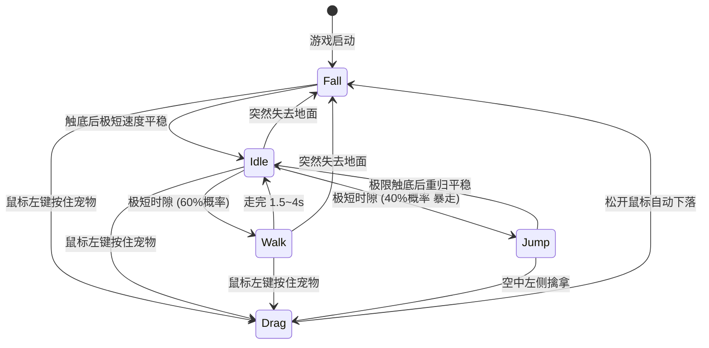

# 📁 项目结构文档

## 目录总览

```
Desktop_Pet/
├── project.godot              ← Godot 项目入口文件 (相当于 package.json)
├── main.tscn                  ← 启动场景 (Godot 的"入口页面")
├── main.gd                    ← 启动脚本 (窗口设置 + 边界墙 + 宠物生成 + 幽灵墙 + 窗口交互三模式 + 性能调频 + 提醒系统)
│
├── core/                      ← 核心工具层 (不依赖具体业务)
│   ├── event_bus.gd           ← 全局事件总线 (Autoload 单例)
│   └── settings_manager.gd   ← 持久化设置管理器 (Autoload，基于 ConfigFile)
│
├── ui/                        ← UI 界面层
│   ├── context_menu.tscn      ← 全息追踪菜单场景 (右键功能面板)
│   ├── context_menu.gd        ← UI 专属业务脚本 (弹性跟随 + 开关控制 + 持久化恢复)
│   ├── reminder_panel.gd      ← 提醒管理面板 (增删提醒 + 定时触发检查)
│   ├── reminder_bubble.gd     ← 气泡通知 (宠物头顶弹出 + overlay_rect 穿透扩展)
│   └── floating_text/         ← 浮动文字特效 (预留)
│
├── entities/                  ← 实体层 (游戏中的"东西")
│   └── pet/                   ← 宠物模块
│       ├── pet.tscn           ← 宠物场景文件 (定义了物理碰撞体)
│       ├── pet.gd             ← 宠物控制器 (状态机 + 输入 + 视觉渲染)
│       ├── eye_behavior.gd    ← 瞳孔行为控制器 (追踪/游走/眨眼)
│       └── states/            ← 状态机目录
│           ├── state.gd       ← 状态基类 (所有状态继承它)
│           ├── idle.gd        ← 待机状态
│           ├── walk.gd        ← 行走状态
│           ├── drag.gd        ← 拖拽状态
│           ├── fall.gd        ← 掉落状态
│           └── jump.gd        ← 高能弹跳状态
│
├── interop/                   ← 跨语言底层通讯模块 (.NET/C#)
│   └── WindowsManager.cs      ← Win32 API 桥接 (窗口枚举 + 任务栏 + 进程优先级 + 开机自启动)
│
├── docs/                      ← 文档目录
└── README.md                  ← 快速上手指南
```

---

## 文件职责说明

### 🏠 根目录

| 文件 | 类型 | 职责 |
|------|------|------|
| `project.godot` | 配置 | Godot 识别项目的核心文件。包含所有项目设置（透明窗口、渲染器等）。**不要手动编辑**，用 Godot 编辑器的「项目设置」修改 |
| `main.tscn` | 场景 | 项目的启动场景，只有一个 Node2D 根节点并挂载了 main.gd |
| `main.gd` | 脚本 | 初始化一切：设置 120fps 引擎参数 → 设置透明全屏窗口 → 创建隐形边界墙 → 生成宠物 → 管理鼠标穿透区域 (DWM 限流) → 幽灵墙分段裁剪同步 → 系统托盘 |

### ⚙️ core/ — 核心工具层

| 文件 | 职责 |
|------|------|
| `event_bus.gd` | **全局事件总线**。以 Autoload 方式加载，在项目的任何地方都能用 `EventBus.信号名` 来发送/监听事件，实现模块间解耦通信 |
| `settings_manager.gd` | **持久化设置管理器**。以 Autoload 方式加载，基于 `ConfigFile` 将开关状态和提醒数据保存到 `user://settings.cfg`。pet 启动时直接读取，不依赖信号时序 |

> **什么是 Autoload？** 相当于 Vue 的全局插件或 Pinia store。在「项目设置 → 全局」中注册后，整个项目任何脚本都能直接用 `EventBus` 这个名字访问它。

### 🎨 ui/ — 界面层

| 文件 | 职责 |
|------|------|
| `context_menu.tscn` | 全息追踪菜单场景树，包含眼球追踪/冲击波/自启动开关按钮 + 窗口模式切换(含说明文字) + 提醒管理入口 |
| `context_menu.gd` | 菜单 UI 逻辑：弹性跟随宠物 (Lerp)、Q 弹呼出/收回 (Tween)、启动时从 SettingsManager 恢复开关状态、窗口模式三态切换 + 描述更新、开机自启动注册表操作 |
| `reminder_panel.gd` | **提醒管理面板**：跟随宠物上方弹出。支持添加/删除/启用禁用提醒条目。每 10 秒检查系统时间，匹配时触发气泡通知。含「⚡ 测试触发」按钮 |
| `reminder_bubble.gd` | **气泡通知**：宠物头顶弹出金色边框消息气泡。弹簧动画弹入，6 秒后淡出上飘。通过 `pet.overlay_rect` 将自身区域注册到穿透多边形，确保不被 DWM 裁剪 |

## 核心组件与职责

| 文件 | 角色 | 行为描述 |
|------|------|---------
| `main.gd` | 启动场景主系统 | 开启无边框透明窗口、建立自适应视口的四面物理碰撞墙。<br>**【DWM渲染优化】** 穿透区域刷新限流至 ~60hz (8px 空间量化 + 16ms 时间节流)，引擎强制 120fps / 120 physics ticks。<br>**【幽灵墙系统】** 通过 C# 层 Win32 API 获取桌面窗口列表，使用**分段裁剪算法**计算每条踏板被遮挡后剩余的可见水平分段，生成独立碰撞体。<br>**【窗口交互三模式】** 自由漫游 (单向踏板) / 窗口封闭 (合并外墙 + Sweep-Line 虚空填充) / 窗口排斥 (旋转法线单向碰撞)。自动过滤最大化窗口。<br>**【隐秘常驻系统】** 通过 C# 层强推 `WS_EX_TOOLWINDOW` 洗去任务栏挂载，利用 `StatusIndicator` 长驻系统托盘，并提升进程优先级至 Above Normal。 |
| `pet.tscn` | 宠物预制体 | 包含 Rigidbody2D 底盘、外壳绘制、以及负责收发内部交互事件的信号。 |
| `pet.gd` | 渲染与总线中心 | 承载状态机调度 + 拖影/冲击波特效系统 + 科幻单眼渲染 (外壳 + 机械虹膜眨眼 + 智能瞳孔)。按需 queue_redraw：只在有特效/运动/眼球动画时重绘。 |
| `eye_behavior.gd` | 瞳孔行为控制器 | RefCounted 轻量级控制器。管理三种瞳孔模式：**鼠标追踪** (12x 速率锁定) → **好奇游走** (鼠标静止 2.5s 后自主漫游) → **关闭追踪** (始终游走)。配合**机械虹膜眨眼**：每 2.5~7s 内圈光圈收缩至 5%，20% 概率连眨。 |

### 🌉 interop/ — 跨语言底层通讯模块 (.NET/C#)

> ⚠️ 此目录下的代码运行机制完全脱离了 Godot 自带的封闭沙盒，直接在系统内核边缘游走。

| 文件 | 角色 | 行为描述 |
|------|------|---------
| `WindowsManager.cs` | Win32 API 桥接 | 使用 `[DllImport]` 抽取 `user32.dll`、`dwmapi.dll`、`kernel32.dll` 和 .NET `Registry` API。<br>**GetVisibleWindowRects()**: 枚举桌面窗口 (含 DWMWA_CLOAKED 过滤 + Z-Order 遮挡剔除)。<br>**HideFromTaskbar()**: 推 WS_EX_TOOLWINDOW 隐藏任务栏图标。<br>**BoostProcessPriority()**: 提升进程优先级至 Above Normal。<br>**IsAutoStartEnabled() / SetAutoStart()**: 操作 `HKCU\Run` 注册表实现开机自启动。 |

### 🎭 entities/pet/states/ — 有限状态机 (FSM)

| 文件 | 角色 | 行为描述 |
|------|------|---------
| `state.gd` | 基类 | 定义了所有状态共有的接口：`enter()` `exit()` `process()` `physics_process()` `input()` |
| `idle.gd` | 待机 | 闲置时间极短(0.3~1.5s)，极度活跃。结束时随机抛硬币转向 Walk (60%) 或 Jump (40%) |
| `walk.gd` | 行走 | 只保留施加滚轴方向推力，控制横向位移 |
| `drag.gd` | 拖拽 | 弹簧力公式 `F = k·x - c·v` 让宠物弹性跟随鼠标，降低重力 |
| `fall.gd` | 掉落 | 自由落体下坠，接管底层触地 |
| `jump.gd` | 高能弹跳 | 高能弹跳机制：给予极其庞大的向上随机倾斜冲量与几万量级的超级扭矩 |

---

## 状态流转图



---

## 右键菜单功能项

| 开关项 | setting_id | 控制目标 | 持久化 |
|--------|-----------|---------|--------|
| 眼睛跟随鼠标 | `eye_track` | `EyeBehavior.tracking_enabled` — 关闭后瞳孔改为全程好奇游走 | ✅ |
| 撞击冲击波特效 | `shockwave` | `pet.shockwave_enabled` — 控制高速碰撞时的虹彩冲击波 | ✅ |
| 开机自启动 | — | `HKCU\Run` 注册表项 — 通过 WindowsManager C# 读写 | ✅ |
| 窗口模式 | `window_mode` | 三态循环: 🌍自由漫游 → 🔒窗口封闭 → 🚫窗口排斥 (含模式说明文字) | ✅ |
| ⏰ 提醒管理... | — | 打开 `reminder_panel` — 管理定时提醒条目 | ✅ |

---

## 性能优化架构

| 优化项 | 实现位置 | 机制 |
|--------|---------|------|
| DWM 穿透限流 | `main.gd` | 渲染 120fps，穿透区域刷新 ~60hz (16ms 节流 + 8px 量化) |
| 引擎帧率对齐 | `main.gd _ready()` | `Engine.max_fps = 120` + `Engine.physics_ticks_per_second = 120` |
| 按需重绘 | `pet.gd _process()` | 只在有特效/运动/眼球动画时 `queue_redraw()` |
| 进程提权 | `WindowsManager.cs` | `SetPriorityClass(ABOVE_NORMAL)` 对抗游戏资源抢占 |
| 淡出防裁剪 | `context_menu.gd` / `reminder_panel.gd` | 关闭动画结束后才发 `toggled(false)`，防止 DWM 中途裁剪 |
| 覆盖层穿透 | `reminder_bubble.gd` → `pet.overlay_rect` | 气泡区域注册到穿透多边形，grow(60) 覆盖上飘动画 |
| 窗口隐身启动 | `main.gd _ready()` | 先 `visible=false` → 设置窗口 → HideFromTaskbar → `visible=true` |

---

## 关键概念映射 (前端 → Godot)

如果你有前端背景，这些对照关系会帮助理解：

| 前端概念 | Godot 对应 | 说明 |
|---------|-----------|------|
| HTML 元素 | **Node (节点)** | 一切皆节点，构成树形层级 |
| Vue 组件 `.vue` | **Scene (场景) `.tscn`** | 可复用的节点树模板 |
| `<script>` | **GDScript `.gd`** | 挂载在节点上的脚本 |
| `package.json` | **`project.godot`** | 项目配置的核心文件 |
| Pinia Store | **Autoload** | 全局单例 (如 EventBus) |
| `emit()` / `$emit()` | **Signal (信号)** | Godot 的事件系统 |
| CSS 动画 | **`_draw()` + `queue_redraw()`** | 每帧用代码绘制图形 |
| `requestAnimationFrame()` | **`_process(delta)`** | 每帧调用 (渲染帧) |
| 无对应 | **`_physics_process(delta)`** | 每物理帧调用 (固定 120fps) |
| DOM 树 | **Scene Tree (场景树)** | 节点的父子层级结构 |
