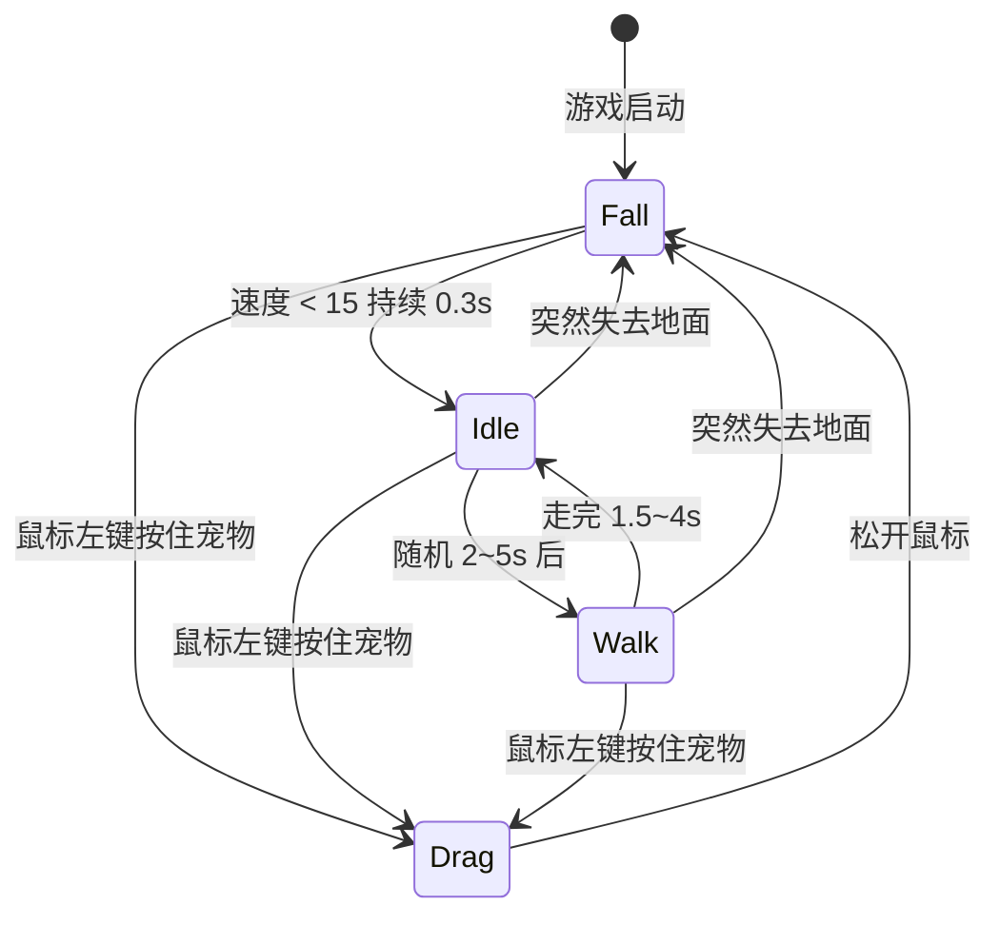

# 📁 项目结构文档

## 目录总览

```
Desktop_Pet/
├── project.godot              ← Godot 项目入口文件 (相当于 package.json)
├── main.tscn                  ← 启动场景 (Godot 的"入口页面")
├── main.gd                    ← 启动脚本 (窗口设置 + 边界墙 + 宠物生成)
│
├── core/                      ← 核心工具层 (不依赖具体业务)
│   └── event_bus.gd           ← 全局事件总线 (Autoload 单例)
│
├── ui/                        ← UI 界面层
│   ├── context_menu.tscn      ← 全息追踪菜单场景 (右键功能面板)
│   └── context_menu.gd        ← UI 专属业务脚
│
├── entities/                  ← 实体层 (游戏中的"东西")
│   └── pet/                   ← 宠物模块
│       ├── pet.tscn           ← 宠物场景文件 (定义了物理碰撞体)
│       ├── pet.gd             ← 宠物控制器 (状态机 + 输入 + 视觉渲染)
│       └── states/            ← 状态机目录
│           ├── state.gd       ← 状态基类 (所有状态继承它)
│           ├── idle.gd        ← 待机状态
│           ├── walk.gd        ← 行走状态
│           ├── drag.gd        ← 拖拽状态
│           └── fall.gd        ← 掉落状态
│
├── docs/                      ← 文档目录
└── README.md                  ← 快速上手指南
```

---

## 文件职责说明

### 🏠 根目录

| 文件 | 类型 | 职责 |
|------|------|------|
| `project.godot` | 配置 | Godot 识别项目的核心文件。包含所有项目设置（透明窗口、渲染器等）。**不要手动编辑**，用 Godot 编辑器的「项目设置」修改 |
| `main.tscn` | 场景 | 项目的启动场景，只有一个 Node2D 根节点并挂载了 main.gd |
| `main.gd` | 脚本 | 初始化一切：设置透明全屏窗口 → 创建隐形边界墙 → 生成宠物 → 管理鼠标穿透区域 |

### ⚙️ core/ — 核心工具层

| 文件 | 职责 |
|------|------|
| `event_bus.gd` | **全局事件总线**。以 Autoload 方式加载，在项目的任何地方都能用 `EventBus.信号名` 来发送/监听事件，实现模块间解耦通信 |

> **什么是 Autoload？** 相当于 Vue 的全局插件或 Pinia store。在「项目设置 → 全局」中注册后，整个项目任何脚本都能直接用 `EventBus` 这个名字访问它。

### 🐾 entities/pet/ — 宠物模块

| 文件 | 职责 |
|------|------|
| `pet.tscn` | **宠物场景**。定义了 RigidBody2D (物理刚体) + CircleShape2D (碰撞圆形)。这是宠物的"骨架" |
| `pet.gd` | **宠物控制器**。管理状态机、处理输入事件、绘制科幻风单眼追踪视觉 |

### 🎭 entities/pet/states/ — 有限状态机 (FSM)

| 文件 | 角色 | 行为描述 |
|------|------|---------|
| `state.gd` | 基类 | 定义了所有状态共有的接口：`enter()` `exit()` `process()` `physics_process()` `input()` |
| `idle.gd` | 待机 | 原地呼吸动画，随机 2~5 秒后转入 Walk |
| `walk.gd` | 行走 | 随机选方向，施加水平力推动宠物行走 1.5~4 秒，碰到边缘转向 |
| `drag.gd` | 拖拽 | 弹簧力公式 `F = k·x - c·v` 让宠物弹性跟随鼠标，降低重力 |
| `fall.gd` | 掉落 | 自由落体，速度低于阈值持续 0.3 秒后认为"落稳"，回到 Idle |

---

## 状态流转图



---

## 关键概念映射 (前端 → Godot)

如果你有前端背景，这些对照关系会帮助理解：

| 前端概念 | Godot 对应 | 说明 |
|---------|-----------|------|
| HTML 元素 | **Node (节点)** | 一切皆节点，构成树形层级 |
| Vue 组件 `.vue` | **Scene (场景) `.tscn`** | 可复用的节点树模板 |
| `<script>` | **GDScript `.gd`** | 挂载在节点上的脚本 |
| `package.json` | **`project.godot`** | 项目配置的核心文件 |
| Pinia Store | **Autoload** | 全局单例 (如 EventBus) |
| `emit()` / `$emit()` | **Signal (信号)** | Godot 的事件系统 |
| CSS 动画 | **`_draw()` + `queue_redraw()`** | 每帧用代码绘制图形 |
| `requestAnimationFrame()` | **`_process(delta)`** | 每帧调用 (渲染帧) |
| 无对应 | **`_physics_process(delta)`** | 每物理帧调用 (固定 60fps) |
| DOM 树 | **Scene Tree (场景树)** | 节点的父子层级结构 |
