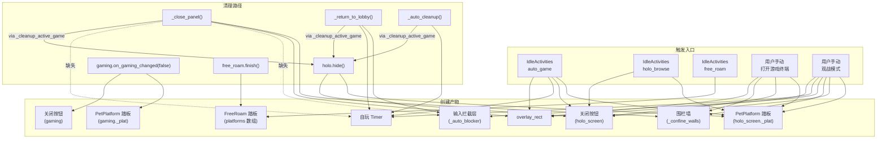

# 踏板 + 宠物自主行为 + 窗口清理 —— 代码关系梳理

> 这三块互相依赖，cleanup 链路断了就会残留阻挡。本文档整理所有相关代码的入口、生命周期、清理链路和风险点。

---

## 一、总览：谁创建了哪些"需要清理的东西"

| 产物 | 创建者 | 类型 | 效果 | 不清理的后果 |
|------|--------|------|------|-------------|
| 悬浮踏板 | PetPlatform.spawn() | StaticBody2D + CollisionShape2D + PlatformVisual | 挡住宠物掉落 | 残留碰撞体，宠物卡空中 |
| 空间跳跃踏板 | FreeRoamSystem._spawn_platform() | StaticBody2D + CollisionShape2D + PlatformVisual | 同上 + 有破碎/定时消失 | 残留碰撞体 |
| 空气墙 | FreeRoamSystem._add_side_walls() | CollisionShape2D (meta: _roam_wall) | 防宠物横移掉落 | 残留碰撞体 |
| 围栏墙 | game_terminal._create_confine_walls() | 4x StaticBody2D | 面板周围物理围栏 | 残留碰撞墙 |
| 关闭按钮 | PetHoloScreen._create_close_btn() / PetGaming._create_close_btn() | Button (add_child 到 pet.parent) | 头顶悬浮按钮 | 残留UI + DWM穿透矩形占位 |
| 输入拦截层 | game_terminal._show_auto_blocker() | Control (MOUSE_FILTER_STOP) | 屏蔽用户输入 (观战模式) | 无法点击/操作 |
| overlay_rect | game_terminal._process() 每帧设 | pet.overlay_rect: Rect2 | DWM 命中区域注册 | 残留穿透矩形 |
| 全息屏状态 | PetHoloScreen.show_*() | visible=true, mode!=OFF | 每帧 queue_redraw + 踏板锁定 | 宠物卡锁定 + 持续重绘 |
| 游戏态状态 | PetGaming.on_gaming_changed(true) | active=true | 宠物锁定 + 物理参数修改 | 宠物无法移动 |
| 自玩定时器 | game_terminal._auto_start_timer() | Timer (add_child 到 CanvasLayer) | 周期调用 auto_play_step | 定时器泄漏 |
| 宠物物理参数 | PetPlatform.lock_pet() | gravity_scale=0, linear_damp=20 | 宠物悬浮 | 没恢复重力 |

---

## 二、踏板系统

### 2.1 PetPlatform (共享踏板)

**文件**: [pet_platform.gd](file:///e:/Code/GodotDesktopPet/entities/pet/pet_platform.gd)

**使用者** (各自持有独立实例):
- `PetGaming._plat` — 扩展包游戏态
- `PetHoloScreen._plat` — 全息屏终端模式 + 游戏终端锁定模式

**生命周期**:

```
lock_pet(pet)                           unlock_pet(pet)
      │                                       │
      ├─ finish 正在进行的 roam               ├─ remove(pet)
      ├─ linear_damp = 20                     │    ├─ _lift_phase = 0
      ├─ linear_velocity = 0                  │    ├─ gravity_scale = gravity_sign (恢复!)
      ├─ transition_to("idle")                │    ├─ 禁用碰撞 (child.disabled = true)
      └─ spawn(pet)                           │    ├─ _platform = null
           ├─ 创建 StaticBody2D               │    └─ 淡出 0.3s → queue_free()
           ├─ 碰撞体 + PlatformVisual         │
           ├─ parent.add_child(body)          └─ (不做状态切换，调用方自行处理)
           ├─ gravity_scale = 0 (!!)
           └─ _lift_phase = 1, 开始升降

update(pet, delta)
      ├─ phase 1: 升降中 → 驱动位置
      └─ phase 2: 已到位 → 锁定速度+位置
```

> [!WARNING]
> `spawn()` 设 `gravity_scale = 0`，`remove()` 恢复为 `gravity_sign`。如果 `remove()` 没被调用，宠物永久悬浮。

### 2.2 FreeRoamSystem (空间跳跃踏板)

**文件**: [free_roam.gd](file:///e:/Code/GodotDesktopPet/entities/pet/free_roam.gd)

**使用者**: pet.free_roam_sys (pet._process 驱动 update)

**创建的节点**:
- `_spawn_platform()` → StaticBody2D + CollisionShape2D + PlatformVisual → add_child 到 pet.parent
- `_add_side_walls()` → CollisionShape2D (meta: _roam_wall) → add_child 到 _current_plat
- 破碎效果: Polygon2D 碎片 → add_child 到 pet.parent (自带 tween 清理)

**清理链路**:

```
finish()
  ├─ _remove_side_walls()     → 禁用 + queue_free 空气墙
  ├─ _clear_platforms()        → 淡出 + queue_free 所有踏板
  ├─ active = false
  ├─ gravity_scale = gravity_sign  (恢复重力)
  ├─ _elevator = null, _current_plat = null
  ├─ friction = 0.6 (恢复摩擦力)
  └─ 重置 idle 计时器 (防 finish 后立刻 walk 抢方向)
```

**被谁调用 finish()**:
- `_jump_down()` — 跳下结束
- `_begin_descent()` — 电梯到底
- `PetPlatform.lock_pet()` → 如果 roam 正在进行 → 先调 `free_roam_sys.finish()`
- 拖拽打断: `drag.gd.enter()` 检查 `pet._roam_active` → `pet.free_roam_sys.finish()`

---

## 三、宠物自主行为调度

### 3.1 IdleActivities (自主活动调度器)

**文件**: [idle_activities.gd](file:///e:/Code/GodotDesktopPet/entities/pet/idle_activities.gd)

**驱动**: `pet._process()` → `idle_activities.update(delta)`

**活动池**:
| 活动 | 权重 | 实现 | 创建的产物 |
|------|------|------|-----------|
| free_roam | 3.0 (50%) | pet._start_free_roam() | FreeRoam 踏板 |
| holo_browse | 2.0 (33%) | pet.holo_screen.show_xxx() | PetPlatform 踏板 + 关闭按钮 |
| auto_game | 1.0 (17%) | EventBus.terminal_auto_game.emit() | 游戏终端全套 |

**前置条件** (`_can_run`):
```
必须全部满足:
  ✓ idle 状态
  ✓ 自由行动模式 (behavior_mode == 0)
  ✓ 非深夜
  ✓ 非游戏中 (gaming.active == false)
  ✓ 非 roam 中
  ✓ 非 holo_screen._game_locked
  ✓ 微行为不活跃
```

### 3.2 auto_game 触发链路 (最复杂!)

```
IdleActivities._do_auto_game()
  └─ EventBus.terminal_auto_game.emit(random_game_id)
      └─ game_terminal.launch_auto_game(game_id)              ← 后台模式入口
          ├─ _auto_play = true
          ├─ panel.visible = true, panel.modulate.a = 0.0      ← 面板透明但渲染
          ├─ _is_open = true
          ├─ _launch_terminal_game(game_id)
          │    ├─ 创建游戏 Control, add_child 到 _content_stack
          │    ├─ 激活全息投影 _activate_holo_preview()
          │    │    └─ holo.show_game(texture, side, lock=true)
          │    │         ├─ mode = GAME, _game_locked = true
          │    │         ├─ 展开动画
          │    │         ├─ _lock_pet()                        ← PetPlatform 踏板!
          │    │         └─ _create_close_btn("游戏终端")      ← 关闭按钮!
          │    └─ 更新标题/HUD/底栏
          └─ _auto_start_timer()                               ← Timer!
```

**后台自玩结束清理链路**:

```
game_over 信号 → _on_game_over(result)
  ├─ _auto_stop_timer()
  └─ _auto_finish_and_close()
      ├─ await 3秒
      └─ _auto_cleanup()
          ├─ _auto_play = false
          ├─ _auto_stop_timer()
          ├─ _cleanup_active_game()
          │    ├─ _deactivate_holo_preview()
          │    │    └─ holo.hide()
          │    │         ├─ _game_locked: _retracting = true
          │    │         ├─ _unlock_pet()             ← PetPlatform.remove()
          │    │         │    └─ 恢复重力 + 淡出踏板
          │    │         └─ _remove_close_btn()       ← 移除关闭按钮
          │    └─ _active_game.queue_free()
          ├─ panel.visible = false
          ├─ panel.modulate.a = 1.0                   ← 恢复透明度
          └─ _is_open = false
```

### 3.3 holo_browse 触发链路

```
IdleActivities._do_holo_browse()
  └─ pet.holo_screen.show_xxx(side, duration)
      ├─ 如果已有终端模式 → _cleanup_active_mode()
      ├─ mode = xxx
      ├─ visible = true, _deploying = true
      ├─ _lock_pet()                                   ← PetPlatform 踏板!
      └─ _create_close_btn(label)                      ← 关闭按钮!
```

**定时自动隐藏清理链路** (duration > 0):

```
PetHoloScreen.update(delta)
  └─ _idle_elapsed >= _idle_duration
      └─ hide()
          ├─ _retracting = true
          └─ _cleanup_active_mode()
              ├─ _unlock_pet()                         ← PetPlatform.remove()
              └─ _remove_close_btn()

(收起动画结束后):
update() → _deploy_progress <= 0 → visible=false, mode=OFF
```

---

## 四、游戏终端面板清理

**文件**: [game_terminal.gd](file:///e:/Code/GodotDesktopPet/ui/game_terminal/game_terminal.gd)

### 4.1 手动关闭面板

```
_close_panel()
  ├─ _is_open = false
  ├─ _state = CLOSED
  ├─ _dragging = false
  ├─ _cleanup_active_game()     ← 清理游戏 + 断开全息
  │    ├─ _deactivate_holo_preview()
  │    │    └─ holo.hide()       ← 如果是 GAME 模式才清理
  │    └─ _active_game.queue_free()
  ├─ _destroy_confine_walls()   ← 清理围栏墙
  ├─ pet.overlay_rect = Rect2() ← 清理 DWM 命中区域
  └─ 淡出动画 → panel.hide()
```

> [!IMPORTANT]
> `_close_panel()` 没有调用 `_hide_auto_blocker()`! 如果在观战模式下直接关闭面板，输入拦截层不会被清理。
> 但 `_cleanup_active_game()` 会 `queue_free` 掉 `_active_game`，拦截层是 `_content_stack` 的子节点不是 `_active_game` 的子节点，所以 **拦截层会残留**。

### 4.2 返回大厅

```
_return_to_lobby()
  ├─ if _auto_play:
  │    ├─ _auto_play = false
  │    ├─ _auto_stop_timer()
  ├─ _hide_auto_blocker()       ← 清理拦截层 (OK)
  ├─ _cleanup_active_game()
  ├─ _clear_hud_slots()
  └─ lobby 恢复
```

### 4.3 后台自玩清理

```
_auto_cleanup()
  ├─ _auto_play = false
  ├─ _auto_stop_timer()         ← 清理 Timer
  ├─ _cleanup_active_game()     ← 清理游戏 + 全息
  ├─ panel.visible = false
  └─ _is_open = false
```

> [!WARNING]
> `_auto_cleanup()` 也没有调用 `_hide_auto_blocker()`。虽然后台模式不会创建 blocker，但如果从观战模式中途触发了某些路径到 `_auto_cleanup()`，blocker 可能残留。

---

## 五、DWM 穿透管理器交互

**文件**: [hit_region_manager.gd](file:///e:/Code/GodotDesktopPet/core/hit_region_manager.gd)

每帧 (~120fps) 收集所有需要点击的区域:

```
_collect_hit_regions()
  遍历每个 pet:
    ├─ 宠物本体圆形: (x, y, radius+15)
    ├─ 本地气泡矩形: get_local_bubble_rects()
    ├─ HUD 面板矩形: get_hud_rect()
    ├─ overlay_rect (游戏/终端面板矩形)
    ├─ 全息屏关闭按钮: holo_screen.get_close_btn_rect()
    ├─ 游戏态关闭按钮: gaming.get_close_btn_rect()
    └─ 待办提醒按钮: prompt_btn_rect meta
  GameManager 面板: get_panel_rects()
```

关键点: **关闭按钮和 overlay_rect 都是每帧动态收集的**。所以残留的 Button 实例会导致一个"看不见但占位"的命中矩形，让那个区域无法穿透点击。

---

## 六、风险点汇总

### 6.1 已确认的风险

| 编号 | 风险 | 路径 | 后果 |
|------|------|------|------|
| R1 | `_close_panel()` 不清理 auto_blocker | _close_panel → 没调 _hide_auto_blocker | 观战模式关闭面板后残留输入拦截层 |
| R2 | `_close_panel()` 不清理自玩状态 | _auto_play 仍为 true, Timer 未停 | Timer 持续调用 auto_play_step |
| R3 | `_auto_cleanup()` 不清理 auto_blocker | 同 R1 的另一条路径 | 同上 |
| R4 | await 异步期间状态被打断 | `_auto_finish_and_close` await 3s、`_auto_restart_after_delay` await 2s | await 返回时 game/panel 已被外部清理 → null 访问 |
| R5 | `_deactivate_holo_preview` 条件过严 | 只在 `holo.mode == 1 (GAME)` 时才 hide | 如果 holo 被其他模式覆盖了，原 GAME 模式的踏板不会清理 |

### 6.2 踏板残留高风险场景

| 场景 | 踏板创建者 | 期望清理者 | 风险 |
|------|-----------|-----------|------|
| 后台自玩中途被拖走宠物 | holo_screen._plat (via lock=true) | _auto_cleanup → holo.hide (收起动画) | drag.enter 会抢走状态但不会清理 holo_screen 踏板 |
| 全息屏浏览被新的全息屏覆盖 | holo_screen._plat | _show_terminal → _cleanup_active_mode | OK (会先清理前一个) |
| 游戏态活跃时强制关闭终端 | 两个: gaming._plat + holo_screen._plat | _close_panel → holo.hide | gaming._plat 由 GameManager 这条线清理，但如果 GameManager 没参与… |

### 6.3 关闭按钮残留场景

关闭按钮被 add_child 到 `pet.get_parent()` (即 Main 场景根)。以下情况可能残留:

1. **holo_screen 关闭按钮**: `_cleanup_active_mode()` 会调 `_remove_close_btn()`。但如果 hide 被跳过 (比如直接 `mode = OFF`)，按钮残留
2. **gaming 关闭按钮**: `on_gaming_changed(false)` 调 `_remove_close_btn()`。但如果 gaming 没走正常 deactivate 路径，按钮残留

---

## 七、所有入口的完整清理链路图



> [!CAUTION]
> `_close_panel()` 缺少对 `_auto_blocker` 和 `_auto_timer` 的清理。

---

## 八、各文件职责速查

| 文件 | 关键变量 | 创建的节点 | 清理方法 |
|------|---------|-----------|---------|
| [pet_platform.gd](file:///e:/Code/GodotDesktopPet/entities/pet/pet_platform.gd) | `_platform`, `_lift_phase` | 1x StaticBody2D | `remove(pet)`, `unlock_pet(pet)` |
| [free_roam.gd](file:///e:/Code/GodotDesktopPet/entities/pet/free_roam.gd) | `platforms[]`, `_current_plat`, `_elevator`, `active`, `phase` | N x StaticBody2D + 碎片 Polygon2D | `finish()` |
| [pet_gaming.gd](file:///e:/Code/GodotDesktopPet/entities/pet/pet_gaming.gd) | `active`, `game`, `_plat`, `_close_btn` | 1x Button (关闭按钮) | `on_gaming_changed(false)` |
| [pet_holo_screen.gd](file:///e:/Code/GodotDesktopPet/entities/pet/pet_holo_screen.gd) | `visible`, `mode`, `_plat`, `_close_btn`, `_game_locked` | 1x Button (关闭按钮) | `hide()`, `_cleanup_active_mode()` |
| [idle_activities.gd](file:///e:/Code/GodotDesktopPet/entities/pet/idle_activities.gd) | `mode`, `_elapsed` | 无 (纯调度) | 无需清理自身 |
| [game_terminal.gd](file:///e:/Code/GodotDesktopPet/ui/game_terminal/game_terminal.gd) | `_auto_play`, `_auto_timer`, `_auto_blocker`, `_confine_walls[]`, `_active_game` | Timer + Control(blocker) + 4x StaticBody2D(围栏) | `_close_panel()`, `_return_to_lobby()`, `_auto_cleanup()` |
| [hit_region_manager.gd](file:///e:/Code/GodotDesktopPet/core/hit_region_manager.gd) | `_hit_circles`, `_hit_rects` | 无 | 每帧重新收集，无残留风险 |

---

## 九、修复建议

### 9.1 紧急修复: `_close_panel` 补全清理

```diff
 func _close_panel() -> void:
     _is_open = false
     _state = TerminalState.CLOSED
     _dragging = false
+    # 自玩清理 (观战+后台两种模式)
+    if _auto_play:
+        _auto_play = false
+        _auto_visible = false
+        _auto_stop_timer()
+    _hide_auto_blocker()
     _cleanup_active_game()
     _destroy_confine_walls()
```

### 9.2 `_auto_cleanup` 补全 blocker 清理

```diff
 func _auto_cleanup() -> void:
     _auto_play = false
     _auto_visible = false
     _auto_stop_timer()
+    _hide_auto_blocker()
     _cleanup_active_game()
```

### 9.3 await 防护

`_auto_finish_and_close` 和 `_auto_restart_after_delay` 的 await 返回后应加状态检查 (部分已有，需确认全覆盖)。

### 9.4 长期: 统一清理入口

考虑给游戏终端加一个 `force_cleanup()` 总入口，无论从哪个状态都保证清理所有产物。在 `_close_panel`、`_auto_cleanup`、外部强制关闭等场景统一调用。
